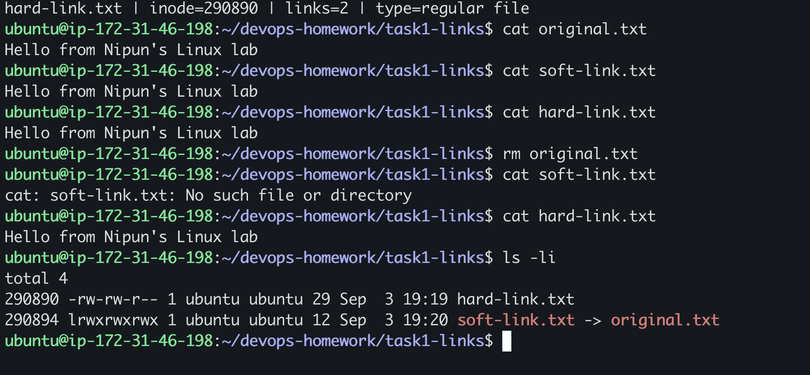
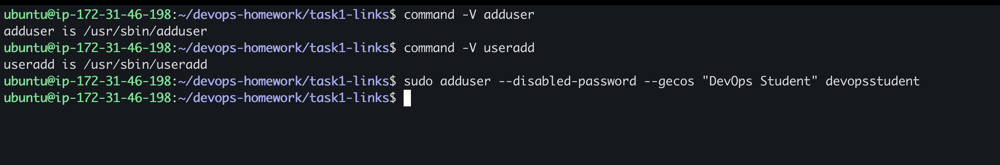
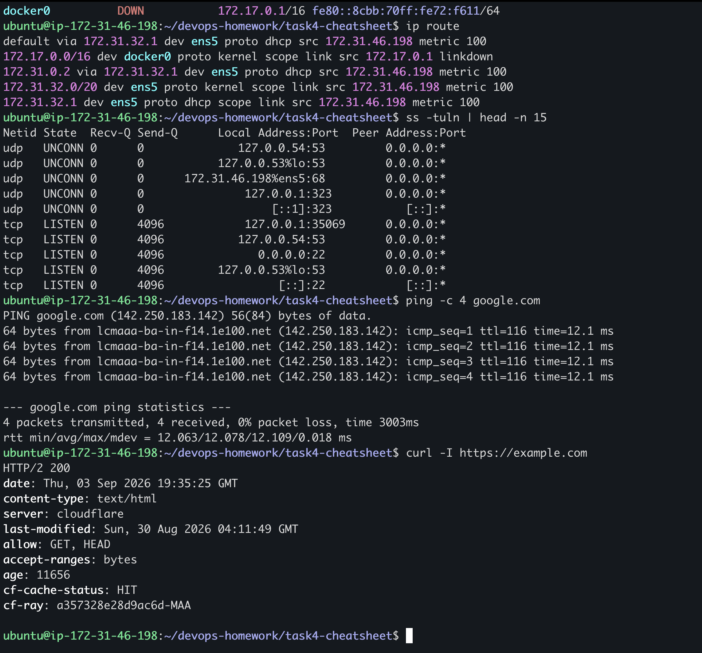

# My Linux Fundamentals Homework

I completed these Linux tasks on my Ubuntu EC2 instance. I practiced links, user creation, system logs, and common commands.

## 1. Soft link and hard link

I created both types of links with `ln`:

```bash
ln -s original.txt soft-link.txt
ln original.txt hard-link.txt
ls -li
```


After deleting the original file, the soft link became broken but the hard link still contained the data.



My complete explanation is in [links.md](links.md).

## 2. adduser and useradd

I used `adduser` because it is the friendlier command on Ubuntu and creates the home directory with useful defaults.




My comparison is in [users.md](users.md).

## 3. journalctl

I used `journalctl` to read recent system logs and filter logs for the SSH service.


My command notes are in [journalctl.md](journalctl.md).

## 4. Linux command practice

I practiced file commands, permissions, system information, processes, and networking commands.




My command cheat sheet is in [linux-cheatsheet.md](linux-cheatsheet.md).

## My lab environment

These exercises were completed on my own AWS EC2 instance.


## What I understood

- Soft links store a pathname, while hard links share the same inode.
- `adduser` is convenient for manually creating users on Ubuntu.
- `journalctl` helps inspect system and service logs.
- Commands such as `df`, `free`, `ps`, `ip`, and `ss` help check a Linux server.
