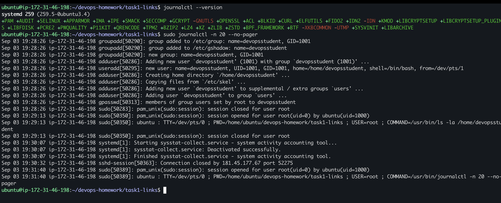
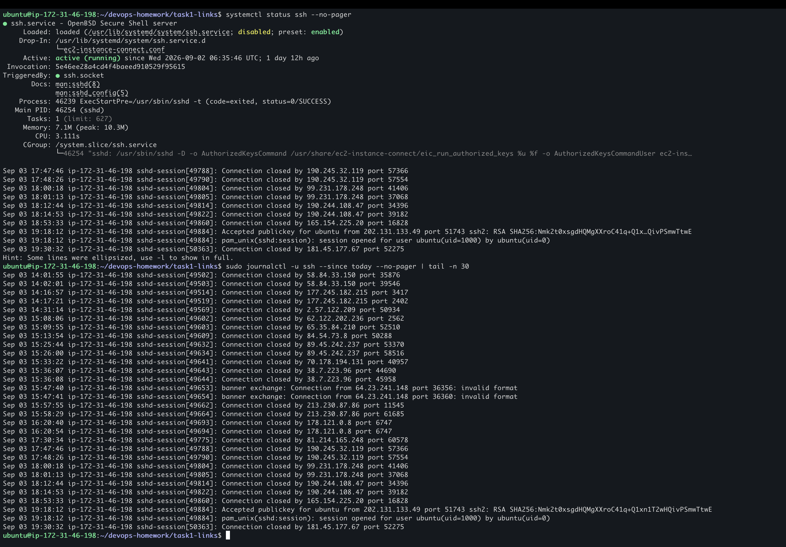

# `journalctl` and Service Logs

## Objective

Use `journalctl` to inspect recent system events and filter logs for a specific systemd service.

## Environment

This task was completed on Nipun's Ubuntu AWS EC2 instance. The terminal hostname is `ip-172-31-46-198`.

## General System Logs

```bash
journalctl --version
sudo journalctl -n 20 --no-pager
```



The output confirms that the server uses systemd and shows the 20 most recent journal entries. These entries include account creation, `sudo` sessions, SSH activity, and system services.

## SSH Service Logs

```bash
systemctl status ssh --no-pager
sudo journalctl -u ssh --since today --no-pager | tail -n 30
```



The service status shows that SSH is active. The filtered journal includes the successful public-key login used for this lab as well as unsuccessful connection attempts from the internet.

## Useful Options

| Option | Purpose |
| --- | --- |
| `-n 20` | Show the latest 20 entries |
| `-u ssh` | Show entries for the SSH service unit |
| `--since today` | Only show entries recorded today |
| `--no-pager` | Print directly instead of opening the interactive pager |
| `-f` | Follow new log entries in real time |

## What I Learned

`journalctl` reads logs collected by `systemd-journald`. It can display system-wide events or filter them by service, time, boot, or priority. This is useful for diagnosing why a service failed, checking recent activity, and confirming whether a service is running correctly.

The SSH journal also showed unsolicited connection attempts. A public EC2 instance should restrict security-group access to port `22` to trusted source IP addresses.
