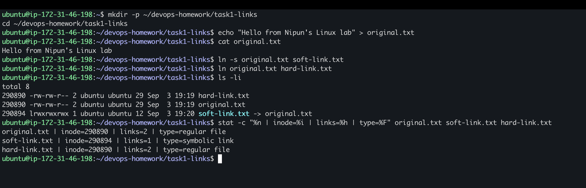

# Soft Links and Hard Links

## Objective

Create symbolic and hard links, compare their inode information, and observe what happens after the original filename is deleted.

## Environment

```text
Ubuntu on AWS EC2
Instance name: docker-demo
Region: Asia Pacific (Hyderabad)
```

The exercise was performed directly on Nipun's Ubuntu EC2 instance. The AWS Console screenshot shows that the instance's private address is `172.31.46.198`; the same address appears in the terminal prompt as `ubuntu@ip-172-31-46-198`.

## AWS Environment Evidence


## Terminal Evidence

### Creating and inspecting the links



### Deleting the original and testing both links


## Commands

```bash
mkdir -p ~/devops-homework/task1-links
cd ~/devops-homework/task1-links

echo "Hello from Nipun's Linux lab" > original.txt
cat original.txt
ln -s original.txt soft-link.txt
ln original.txt hard-link.txt

ls -li
cat original.txt
cat soft-link.txt
cat hard-link.txt
stat -c "%n | inode=%i | links=%h | type=%F" \
  original.txt soft-link.txt hard-link.txt

rm original.txt
cat soft-link.txt
cat hard-link.txt
ls -li
```

## Actual Output

```text
total 8
290890 -rw-rw-r-- 2 ubuntu ubuntu 29 Sep  3 19:19 hard-link.txt
290890 -rw-rw-r-- 2 ubuntu ubuntu 29 Sep  3 19:19 original.txt
290894 lrwxrwxrwx 1 ubuntu ubuntu 12 Sep  3 19:20 soft-link.txt -> original.txt

Hello from Nipun's Linux lab
Hello from Nipun's Linux lab
Hello from Nipun's Linux lab

original.txt | inode=290890 | links=2 | type=regular file
soft-link.txt | inode=290894 | links=1 | type=symbolic link
hard-link.txt | inode=290890 | links=2 | type=regular file

cat: soft-link.txt: No such file or directory
Hello from Nipun's Linux lab

total 4
290890 -rw-rw-r-- 1 ubuntu ubuntu 29 Sep  3 19:19 hard-link.txt
290894 lrwxrwxrwx 1 ubuntu ubuntu 12 Sep  3 19:20 soft-link.txt -> original.txt
```

## What I Learned

| Property | Soft link | Hard link |
| --- | --- | --- |
| What it references | Target pathname | Same inode and underlying data |
| Inode | Different from target | Same as target |
| Link across filesystems | Yes | No |
| Link directories | Normally yes | Normally restricted |
| Target filename deleted | Link becomes broken | Data remains accessible |

The original file and hard link both used inode `290890`. The symbolic link used a separate inode, `290894`. After deleting `original.txt`, the symbolic link could no longer resolve its stored pathname. The hard link continued to work because it still referenced inode `290890`. Its link count changed from `2` to `1`.

## Interview Answer

A symbolic link is a separate file that stores the pathname of another file or directory. It can cross filesystem boundaries, but it becomes broken if its target path disappears. A hard link is another directory entry for the same inode and data. It must remain on the same filesystem, and the data is removed only when its final hard link is deleted.
