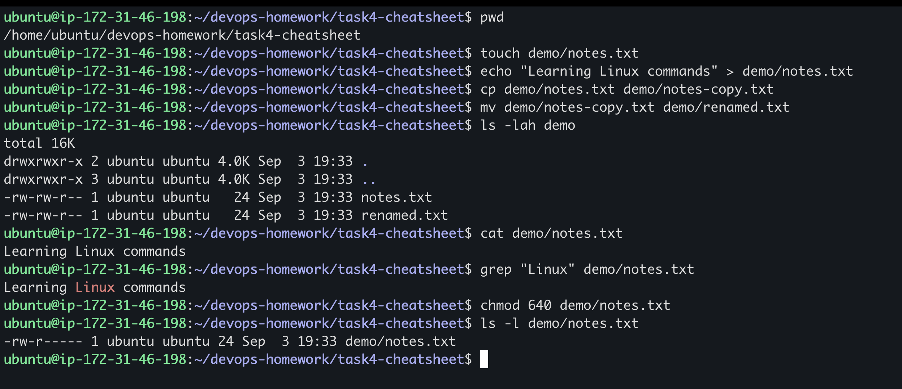
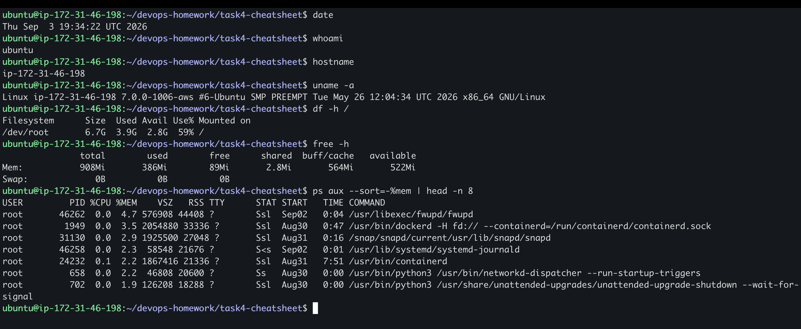

# Linux Command Cheat Sheet Practice

## Objective

Practice essential Linux commands for file management, permissions, system inspection, processes, and networking on an Ubuntu server.

## Files and Permissions

```bash
pwd
touch demo/notes.txt
echo "Learning Linux commands" > demo/notes.txt
cp demo/notes.txt demo/notes-copy.txt
mv demo/notes-copy.txt demo/renamed.txt
ls -lah demo
cat demo/notes.txt
grep "Linux" demo/notes.txt
chmod 640 demo/notes.txt
ls -l demo/notes.txt
```



The permission mode `640` gives the owner read and write access, the group read access, and everyone else no access.

## System and Process Information

```bash
date
whoami
hostname
uname -a
df -h /
free -h
ps aux --sort=-%mem | head -n 8
```



During this exercise, the root filesystem was 59% used. The process listing was sorted by memory usage so the largest consumers appeared first.

## Networking

```bash
ip -brief address
ip route
ss -tuln | head -n 15
ping -c 4 google.com
curl -I https://example.com
```


The server had a default route through its VPC gateway, SSH was listening on port `22`, all four ping packets were returned, and the HTTP request returned status `200`.

## Command Reference

| Command | Basic purpose |
| --- | --- |
| `pwd` | Print the current working directory |
| `touch` | Create an empty file or update its timestamp |
| `echo ... > file` | Write output to a file, replacing its contents |
| `cp` | Copy files or directories |
| `mv` | Move or rename files and directories |
| `ls -lah` | List all files with permissions and human-readable sizes |
| `cat` | Print file contents |
| `grep` | Search text for a pattern |
| `chmod` | Change file permissions |
| `date` | Display the current system date and time |
| `whoami` | Display the current username |
| `hostname` | Display the machine's hostname |
| `uname -a` | Display kernel and operating-system details |
| `df -h` | Display filesystem space usage |
| `free -h` | Display memory and swap usage |
| `ps aux` | Display running processes |
| `ip -brief address` | Summarize network interfaces and addresses |
| `ip route` | Display the routing table |
| `ss -tuln` | Display listening TCP and UDP sockets |
| `ping` | Test network reachability and latency |
| `curl -I` | Request only HTTP response headers |

## What I Learned

Linux commands can be combined with options, pipes, and redirection to inspect and manage a system efficiently. File permissions control access on the server, while resource and networking commands help diagnose performance and connectivity problems. A listening port only shows that a service is available locally; cloud security groups still determine whether that port is reachable from the internet.
