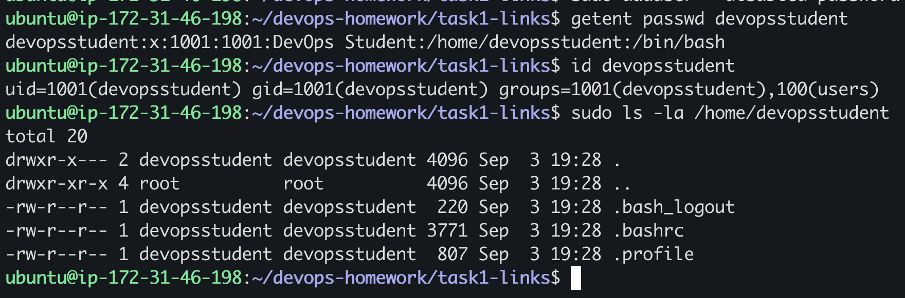

# `adduser` vs `useradd`

## Objective

Compare Ubuntu's `adduser` and `useradd` commands, then create and verify a test account using the recommended command.

## Environment

The task was completed on the same Ubuntu AWS EC2 instance documented in Task 1. The terminal hostname is `ip-172-31-46-198`.

## Creating the User

```bash
command -V adduser
command -V useradd
sudo adduser --disabled-password --gecos "DevOps Student" devopsstudent
```


`--disabled-password` creates the temporary account without embedding or displaying a reusable password.

## Verification

```bash
getent passwd devopsstudent
id devopsstudent
sudo ls -la /home/devopsstudent
```



Important output:

```text
devopsstudent:x:1001:1001:DevOps Student:/home/devopsstudent:/bin/bash
uid=1001(devopsstudent) gid=1001(devopsstudent) groups=1001(devopsstudent),100(users)
```

The output confirms that the user has UID and GID `1001`, belongs to its matching group, uses `/bin/bash`, and has `/home/devopsstudent` containing the standard `.bash_logout`, `.bashrc`, and `.profile` files.

## Comparison

| `adduser` | `useradd` |
| --- | --- |
| Friendly Debian/Ubuntu wrapper | Lower-level Linux utility |
| Creates a home directory by default | Usually requires `-m` to create a home directory |
| Copies initial files from `/etc/skel` | Behavior must be controlled with options and system defaults |
| Suitable for routine manual administration | Suitable for scripts needing explicit control |

## Interview Answer

On Ubuntu, `adduser` is generally preferred for manual account creation because it provides convenient and safer defaults. `useradd` is the lower-level utility and is appropriate for automation when options such as the home directory, shell, and groups are supplied explicitly.
