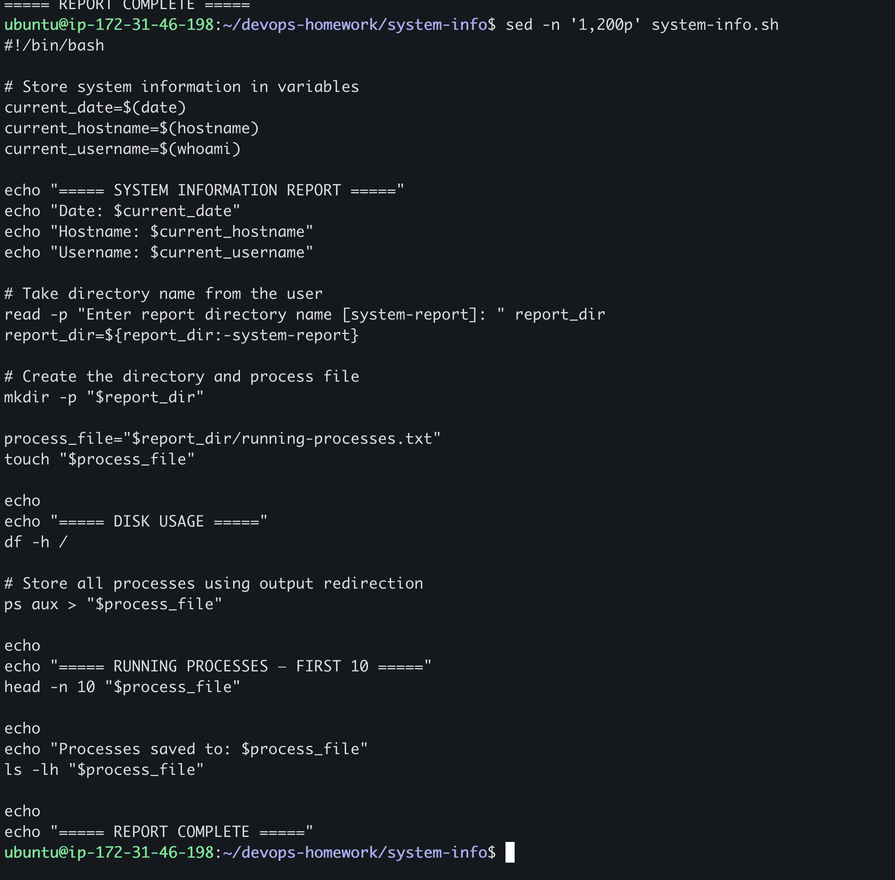
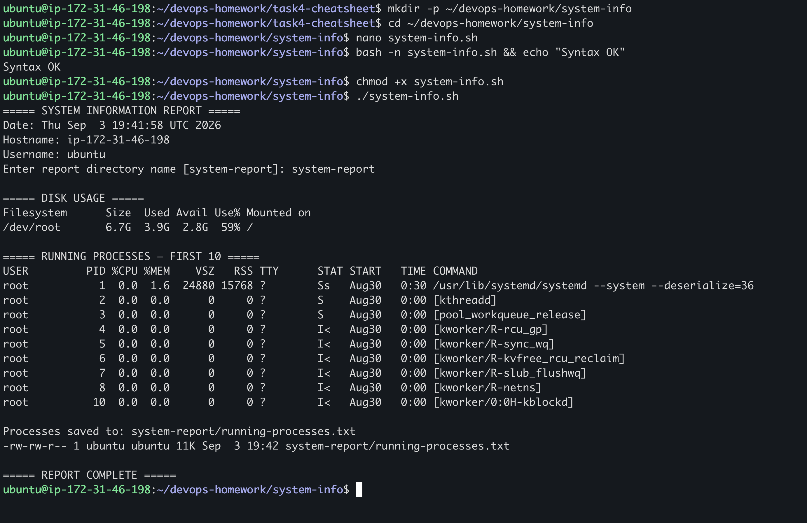
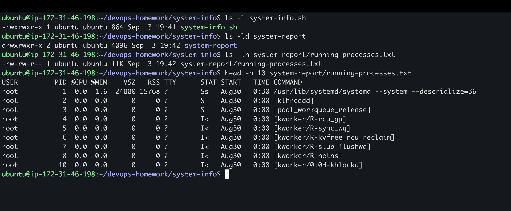

# My System Information Script

## What I did

I made a Bash script that prints basic system details. It asks me for a folder name and saves the running process list inside that folder.

## Environment

The task was completed on Nipun's Ubuntu AWS EC2 instance with hostname `ip-172-31-46-198`.

## Assignment requirements

| Requirement | Implementation |
| --- | --- |
| Current date | `date` stored in `current_date` |
| Hostname | `hostname` stored in `current_hostname` |
| Username | `whoami` stored in `current_username` |
| Disk usage | `df -h /` |
| Running processes | `ps aux` with a ten-line terminal preview |
| Variables | System values, `report_dir`, and `process_file` |
| User input | `read -p` |
| Directory creation | `mkdir -p` |
| File creation | `touch` |
| Output redirection | `ps aux > "$process_file"` |

## Script

My script is here: [`system-info.sh`](system-info.sh).

## Commands Used

```bash
mkdir -p ~/devops-homework/system-info
cd ~/devops-homework/system-info
nano system-info.sh
bash -n system-info.sh && echo "Syntax OK"
chmod +x system-info.sh
./system-info.sh
```

## My script in the terminal



## Running the script



Important output from the completed run:

```text
Syntax OK
===== SYSTEM INFORMATION REPORT =====
Hostname: ip-172-31-46-198
Username: ubuntu
Enter report directory name [system-report]: system-report

===== DISK USAGE =====
Filesystem  Size  Used Avail Use% Mounted on
/dev/root   6.7G  3.9G  2.8G  59% /

Processes saved to: system-report/running-processes.txt
-rw-rw-r-- 1 ubuntu ubuntu 11K Sep 3 19:42 system-report/running-processes.txt
===== REPORT COMPLETE =====
```

## Checking the saved file

```bash
ls -l system-info.sh
ls -ld system-report
ls -lh system-report/running-processes.txt
head -n 10 system-report/running-processes.txt
```



The verification confirms that the script is executable, `system-report` was created, and the full `ps aux` output was saved to `running-processes.txt` using `>` redirection.

## What I understood

Variables let me save values and use them again later. `read -p` takes input from the user. `mkdir` creates the report folder, `touch` creates the file, and `>` puts the output of `ps aux` into that file. I also learned that `>` replaces the previous contents of a file.
