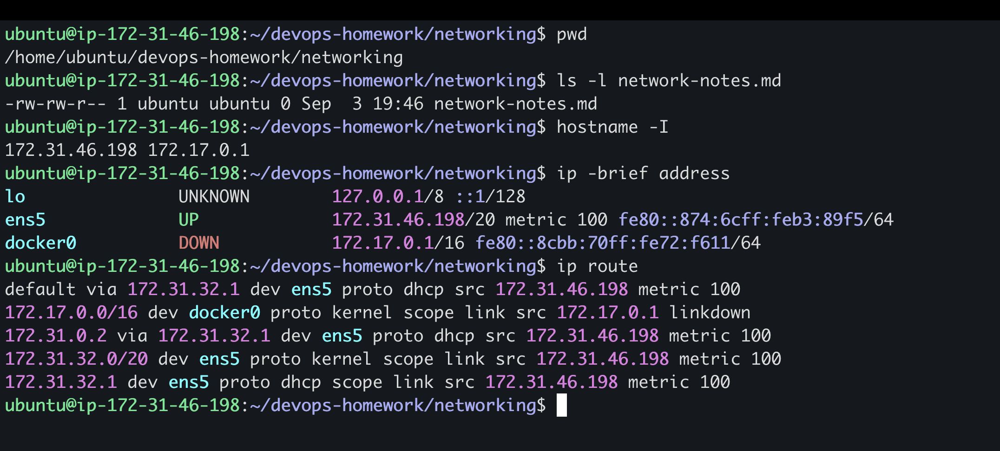
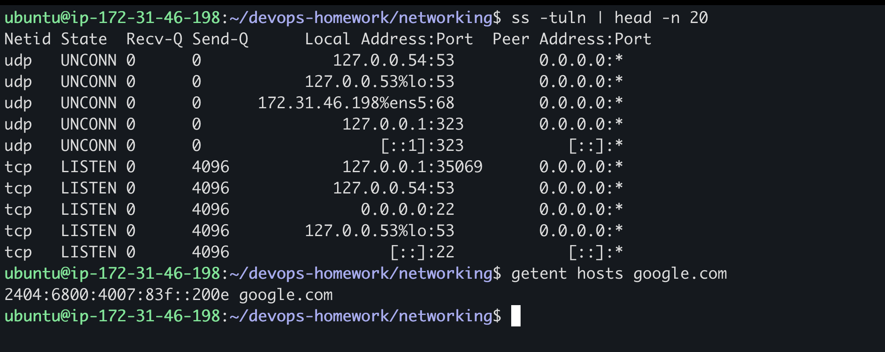
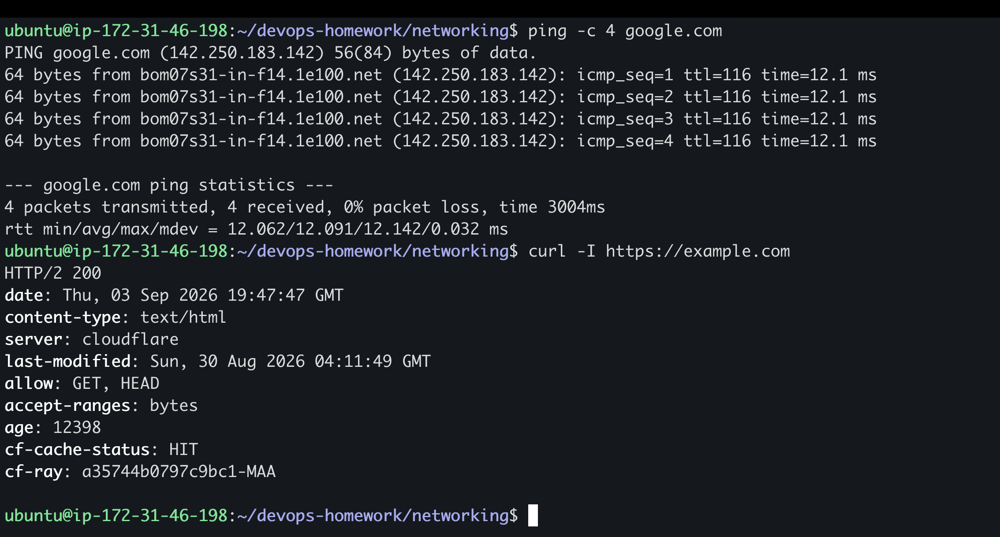

# My Networking Practice

I ran these commands on my Ubuntu EC2 instance to understand basic Linux networking.

## IP address and route

```bash
pwd
ls -l network-notes.md
hostname -I
ip -brief address
ip route
```



What I understood:

- `hostname -I` showed the IP addresses on my server.
- `172.31.46.198` is the private IP of my EC2 instance.
- `172.17.0.1` belongs to the Docker network.
- `ens5` was up and was the main network interface.
- `docker0` was down because no Docker container was using it at that time.
- The default route used `172.31.32.1` as the gateway.

## Open ports and DNS

```bash
ss -tuln | head -n 20
getent hosts google.com
```



What I understood:

- `ss -tuln` showed the TCP and UDP ports listening on the server.
- Port `22` was listening because I was connected using SSH.
- `getent hosts google.com` converted the domain name into an IP address, so DNS was working.

## Ping and HTTP check

```bash
ping -c 4 google.com
curl -I https://example.com
```



What I understood:

- All four ping packets came back, with `0% packet loss`.
- The response time was around 12 milliseconds during my test.
- `curl -I` requested only the HTTP headers.
- `HTTP/2 200` meant the request was successful and the website responded.

## Quick command notes

| Command | What it does |
| --- | --- |
| `hostname -I` | Shows the server's IP addresses |
| `ip -brief address` | Shows interfaces, their state, and addresses |
| `ip route` | Shows the routing table and default gateway |
| `ss -tuln` | Shows listening TCP and UDP ports |
| `getent hosts` | Looks up a hostname using the system's DNS settings |
| `ping` | Tests reachability, delay, and packet loss |
| `curl -I` | Gets HTTP response headers |
