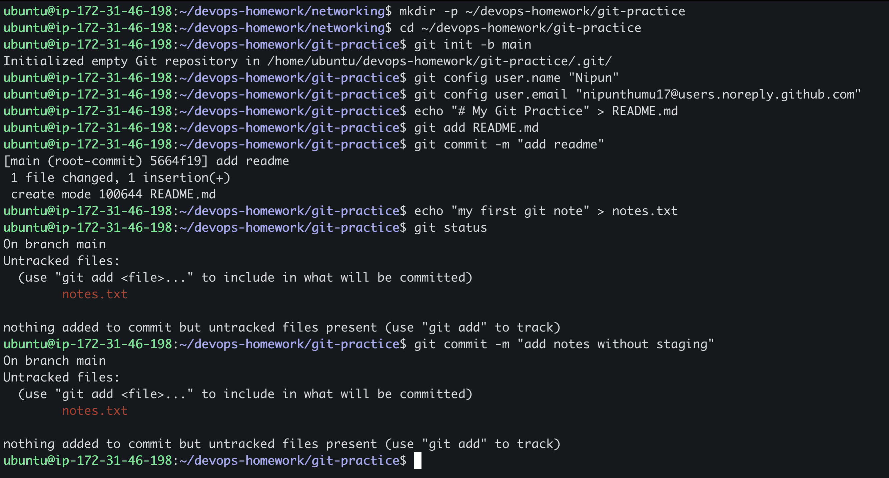
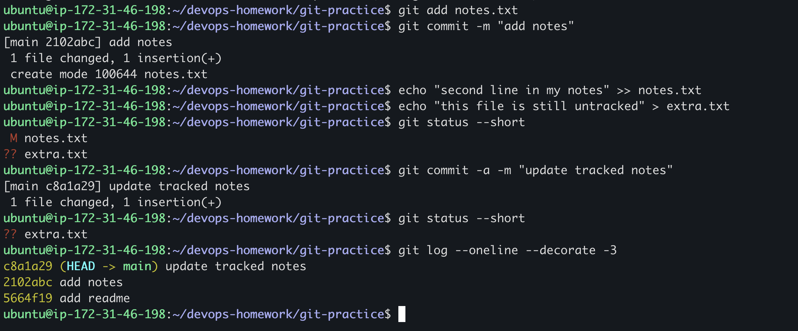
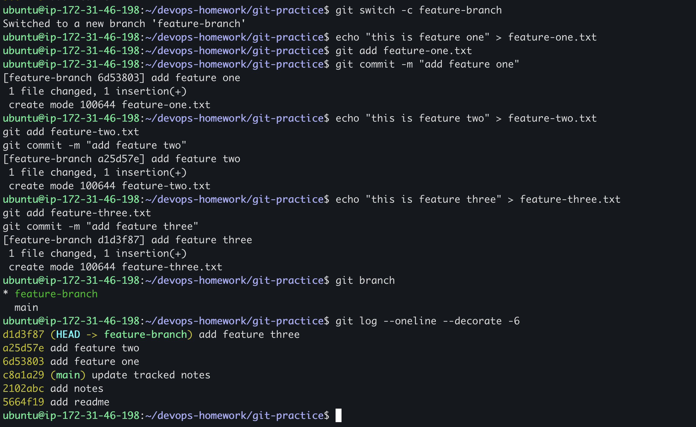
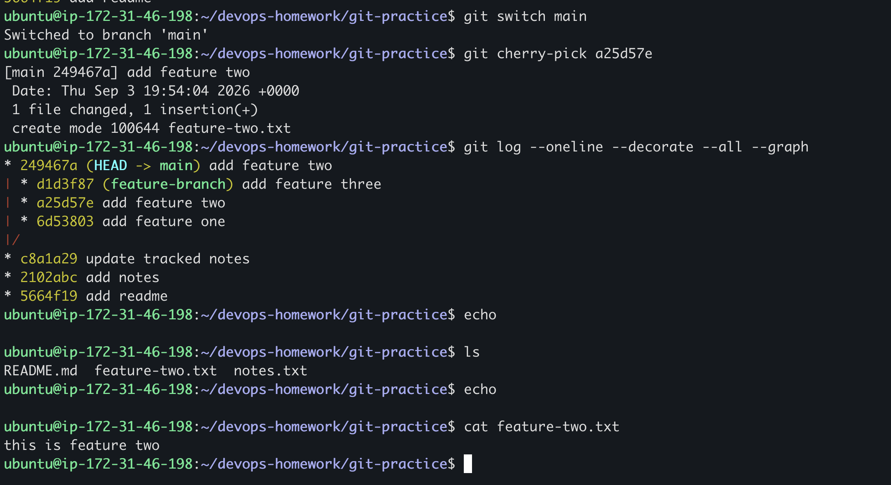

# My Git Practice

I used a small practice repository to understand staging, `git commit -a`, branches, and cherry-pick.

## `git commit -m`

I created `notes.txt` and tried to commit it without running `git add` first.

```bash
echo "my first git note" > notes.txt
git status
git commit -m "add notes without staging"
```



Git displayed `nothing added to commit` because `notes.txt` was a new untracked file. I had to stage it first:

```bash
git add notes.txt
git commit -m "add notes"
```

## `git commit -a -m`

Next, I changed the tracked `notes.txt` file and also created a new `extra.txt` file.

```bash
echo "second line in my notes" >> notes.txt
echo "this file is still untracked" > extra.txt
git status --short
git commit -a -m "update tracked notes"
git status --short
git log --oneline --decorate -3
```



My three commits on `main` were:

```text
c8a1a29 update tracked notes
2102abc add notes
5664f19 add readme
```

What I understood:

- `git commit -m` commits changes that are already staged.
- `git commit -a -m` automatically stages modified or deleted tracked files before committing.
- `-a` does not add brand-new untracked files. This is why `extra.txt` was still shown with `??`.

## Cherry-pick practice

I created `feature-branch` and made three separate commits.

```bash
git switch -c feature-branch

echo "this is feature one" > feature-one.txt
git add feature-one.txt
git commit -m "add feature one"

echo "this is feature two" > feature-two.txt
git add feature-two.txt
git commit -m "add feature two"

echo "this is feature three" > feature-three.txt
git add feature-three.txt
git commit -m "add feature three"

git branch
git log --oneline --decorate -6
```



The feature branch commits were:

```text
d1d3f87 add feature three
a25d57e add feature two
6d53803 add feature one
```

I chose only `a25d57e`, switched back to `main`, and cherry-picked it.

```bash
git switch main
git cherry-pick a25d57e
git log --oneline --decorate --all --graph
ls
cat feature-two.txt
```



The cherry-pick created commit `249467a` on `main`. The commit ID changed because Git created a new commit on a different branch history. `feature-two.txt` appeared on `main`, while `feature-one.txt` and `feature-three.txt` stayed only on `feature-branch`.

## What cherry-pick means

Cherry-pick copies one selected commit onto the branch I am currently using. It is useful when I want one particular change without merging every commit from the other branch.
