# My Docker Hello World Apps

I created six small applications and ran each one inside a Docker container on my Ubuntu EC2 instance.

## Folder structure

```text
05-docker-apps/
├── nodejs-app/
├── python-app/
├── java-app/
├── Apache-app/
├── React-app/
└── nginx-app/
```

I used host port `8080` for every test, so I ran only one container at a time.

## Node.js

```bash
docker build -t my-node-app .
docker run -d --name node-demo -p 8080:3000 my-node-app
```

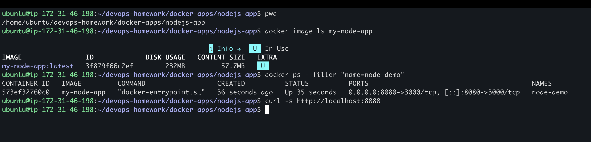

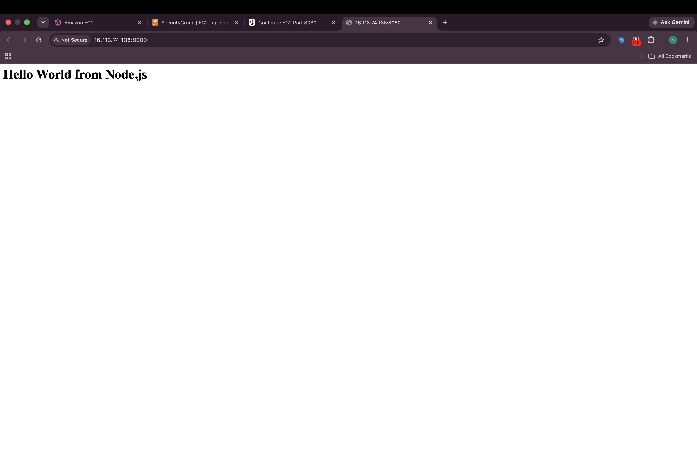

The Node.js container used port `3000` internally and displayed **Hello World from Node.js**.

## Python

```bash
docker build -t my-python-app .
docker run -d --name python-demo -p 8080:5000 my-python-app
```

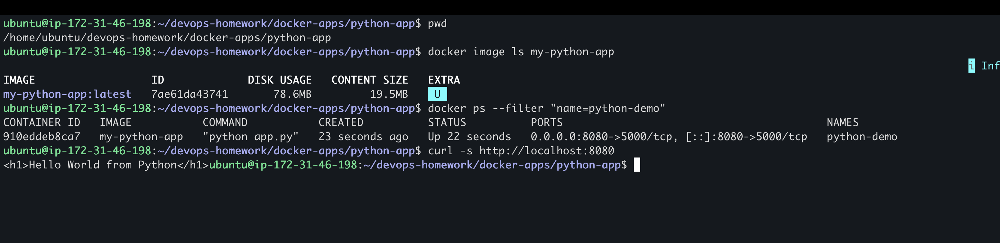

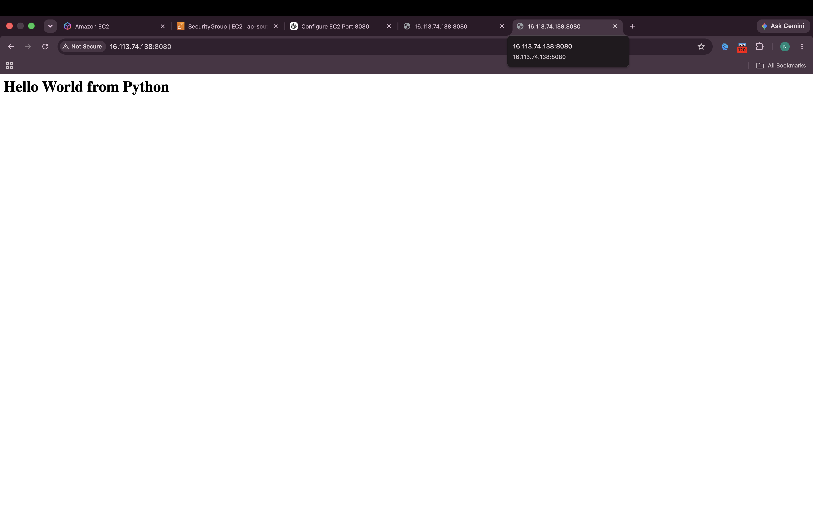

The Python application used the built-in HTTP server and listened on port `5000`.

## Java

```bash
docker build -t my-java-app .
docker run -d --name java-demo -p 8080:8080 my-java-app
```

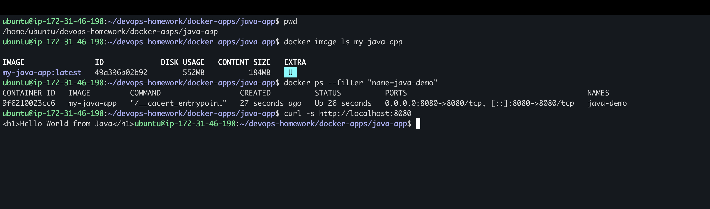

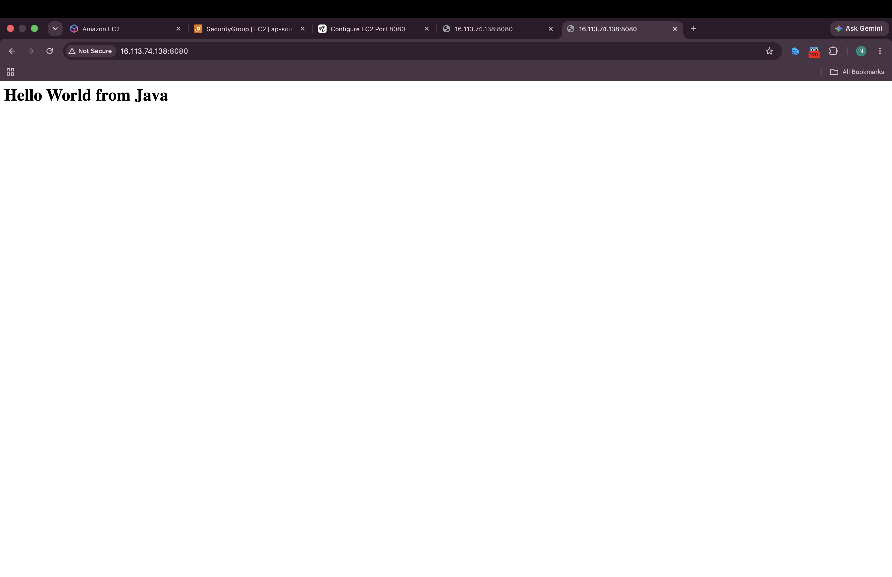

The Java application used `HttpServer` and listened on port `8080` inside the container.

## Apache

```bash
docker build -t my-apache-app .
docker run -d --name apache-demo -p 8080:80 my-apache-app
```

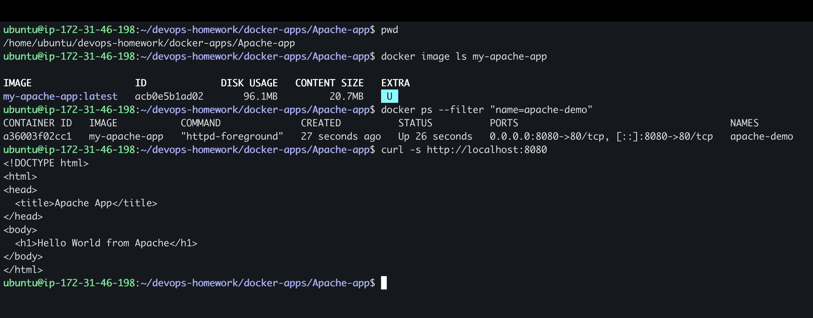

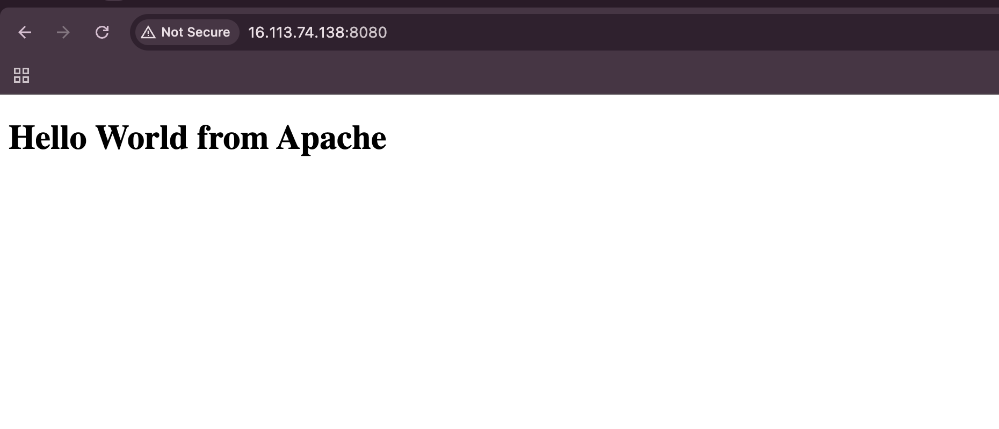

I copied my HTML file into the standard Apache document folder.

## React

```bash
docker build -t my-react-app .
docker run -d --name react-demo -p 8080:80 my-react-app
```

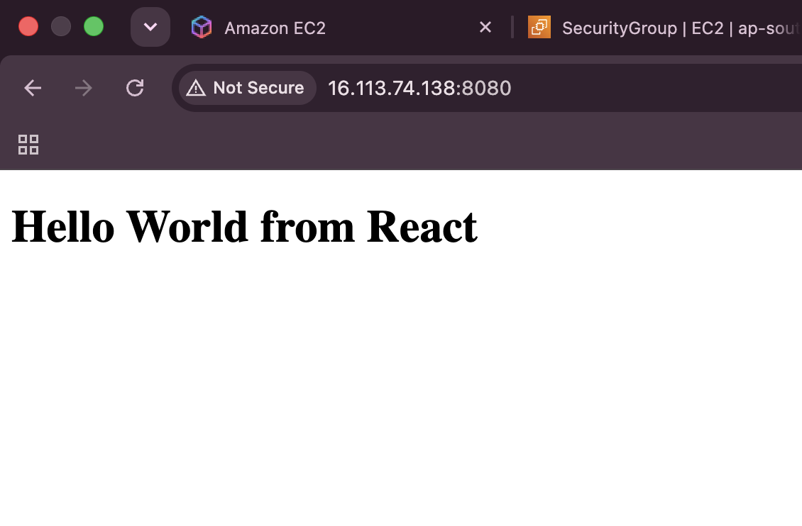

The React page was served from an Nginx container and rendered **Hello World from React**.

## Nginx

```bash
docker build -t my-nginx-app .
docker run -d --name nginx-demo -p 8080:80 my-nginx-app
```

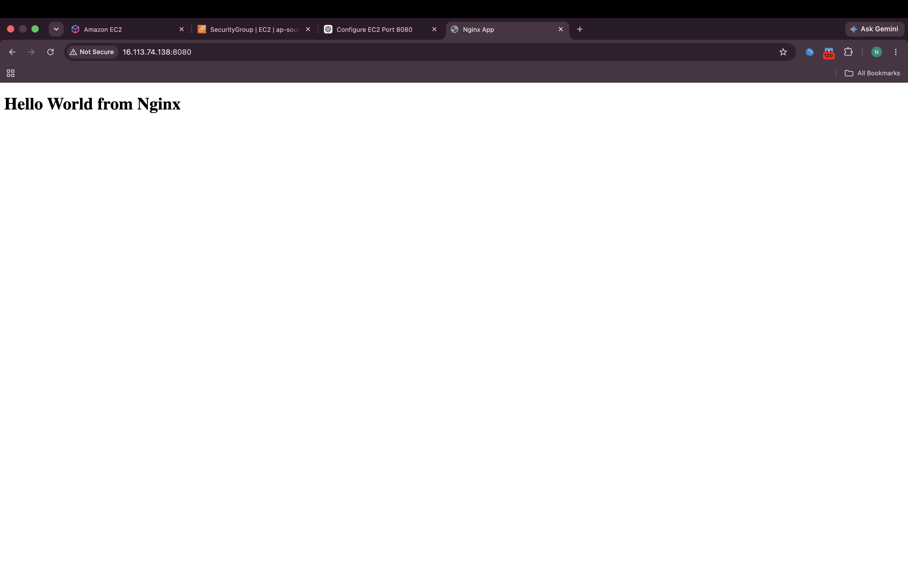

I copied a basic HTML file into the default Nginx website folder.

## Problem I faced

After testing Apache, I forgot to remove its container. React and Nginx initially failed with this error:

```text
Bind for 0.0.0.0:8080 failed: port is already allocated
```

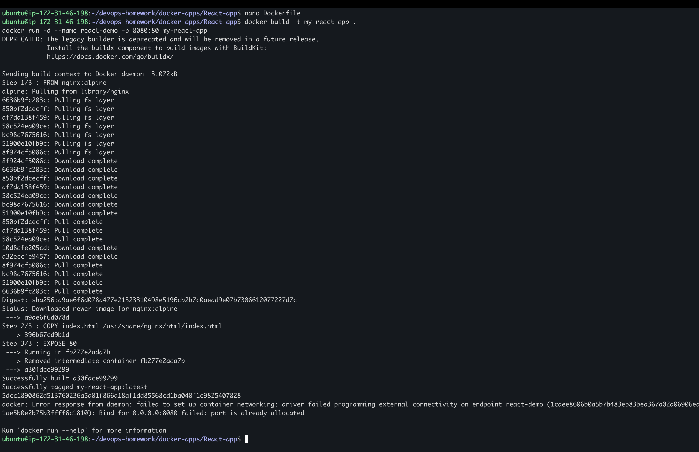

The problem happened because only one container can use the same host port at a time. I fixed it by removing the old container before starting the next one:

```bash
docker rm -f apache-demo react-demo nginx-demo
```

After freeing port `8080`, both final webpages worked.

## What I understood

- A Dockerfile contains the instructions used to build an image.
- `docker build` creates an image.
- `docker run` creates and starts a container from that image.
- `-p` maps a host port to a container port.
- `docker ps` shows running containers.
- Container names and host ports must not conflict with existing containers.
