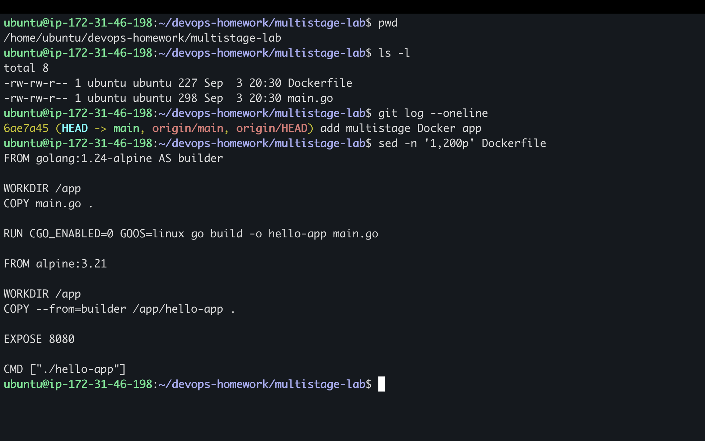
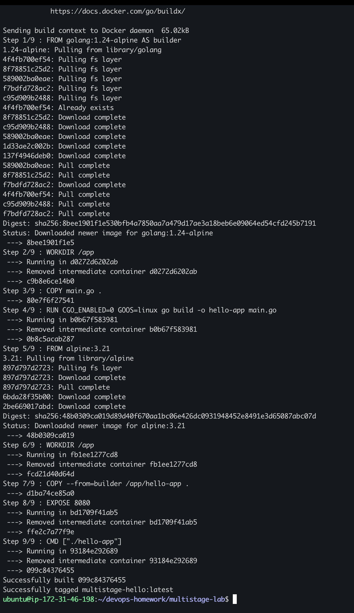
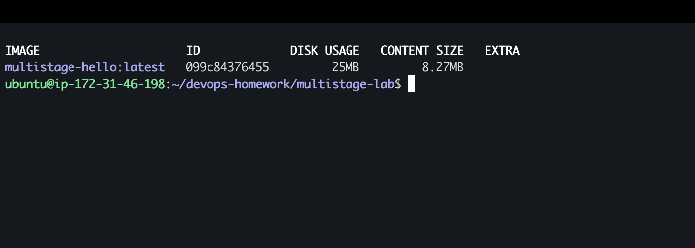
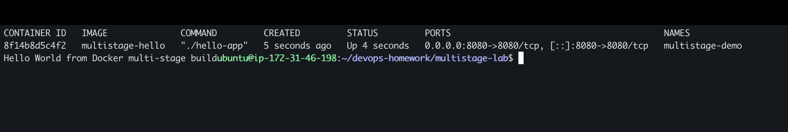
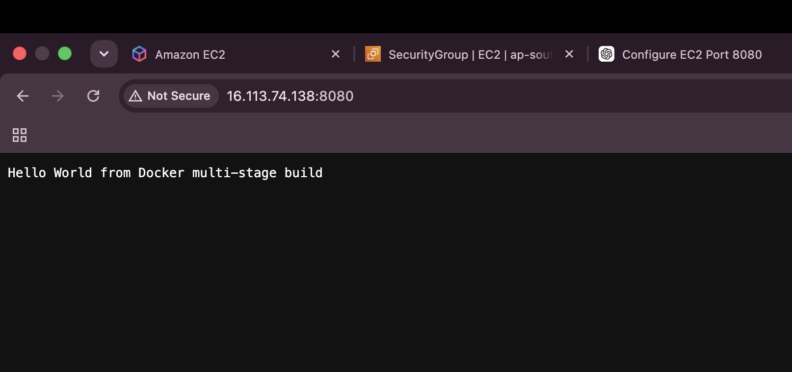

# My Docker Multi-Stage Build

Name: **Nipun Patel Thumu**  
Enrollment number: **ADD ENROLLMENT NUMBER**

## What I did

I created a small Go web application and used a two-stage Dockerfile. I first made it into a Git repository and then cloned it into `multistage-lab` before building the image.

```bash
git clone ./multistage-source multistage-lab
cd multistage-lab
```



## Dockerfile stages

The first stage used the Go image to compile `main.go` into a binary:

```dockerfile
FROM golang:1.24-alpine AS builder
```

The second stage used a small Alpine image and copied only the compiled binary:

```dockerfile
FROM alpine:3.21
COPY --from=builder /app/hello-app .
```

This means the final image does not need to contain the full Go compiler.

## Building the image

```bash
docker build -t multistage-hello .
docker image ls multistage-hello
```





My final image used about `25 MB` of disk and had a content size of about `8.27 MB`.

## Running the container

```bash
docker run -d --name multistage-demo -p 8080:8080 multistage-hello
docker ps --filter "name=multistage-demo"
curl http://localhost:8080
```



The terminal displayed the required output:

```text
Hello World from Docker multi-stage build
```

## Browser output



## Three application types

I also deployed three different types of applications in the previous Docker task:

- [Node.js application](../05-docker-apps/nodejs-app)
- [Python application](../05-docker-apps/python-app)
- [Java application](../05-docker-apps/java-app)

Their Dockerfiles, terminal output, and browser screenshots are available in [My Docker Hello World Apps](../05-docker-apps/README.md).

## What I understood

A multi-stage Dockerfile can use a large image for compiling the application and a smaller image for running it. `COPY --from=builder` moves the finished binary from the build stage into the final stage. This keeps compilers and other build tools out of the final image.
