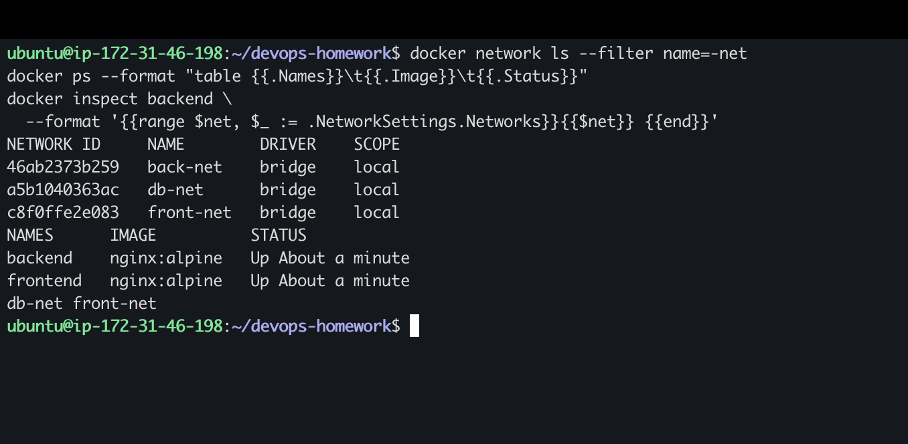
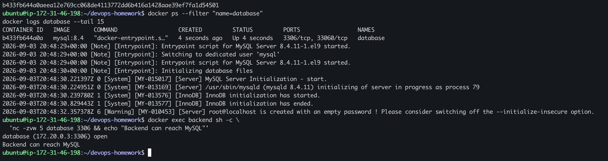
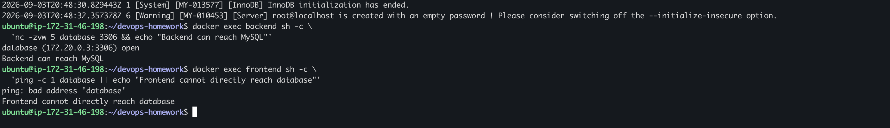
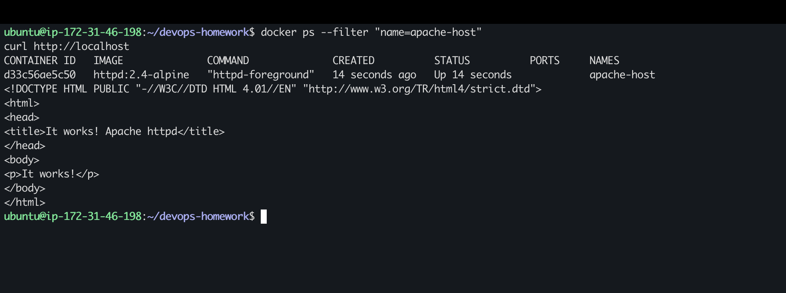
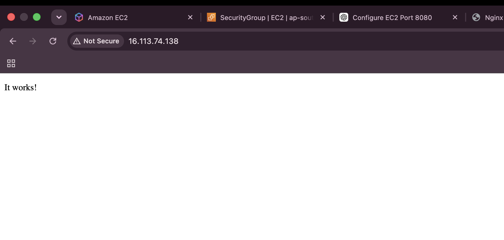
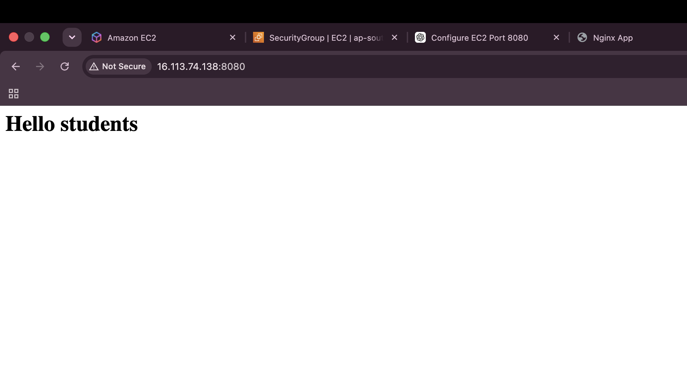
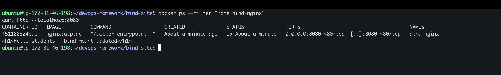
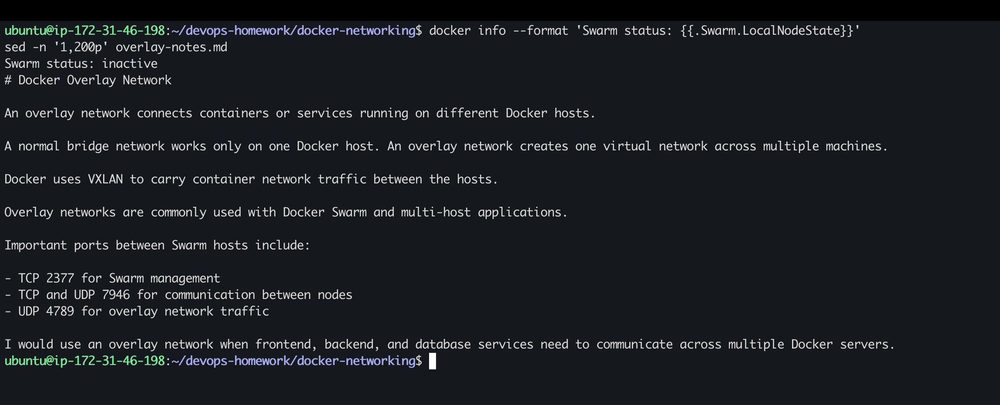

# My Docker Networking and Volume Practice

I did these exercises on my Ubuntu EC2 instance. This section covers container networks, host networking, a bind mount, and my notes about overlay networks.

## Task 1: Container networking

I created three bridge networks:

```bash
docker network create front-net
docker network create back-net
docker network create db-net
```

I used Nginx containers for the frontend and backend, and MySQL for the database. The final connection was:

```text
frontend  -> front-net
backend   -> front-net and db-net
database  -> db-net
```

The backend is connected to two networks so it can communicate with both sides. The frontend and database do not share a network.



### MySQL problem and fix

My first MySQL container stopped while starting because my small EC2 instance was low on memory. I added swap space and recreated the container. After that, it stayed running and the backend could reach MySQL on port `3306`.



I also checked that the frontend could not directly find the database. This is expected because they are on different networks.



The commands I used for testing were:

```bash
docker exec frontend wget -qO- http://backend | head -n 5
docker exec backend sh -c 'nc -zvw 5 database 3306 && echo "Backend can reach MySQL"'
docker exec frontend sh -c 'ping -c 1 database || echo "Frontend cannot directly reach database"'
```

## Task 2: Host network

I ran an Apache container using the host network:

```bash
docker run -d --name apache-host --network host httpd:2.4-alpine
curl http://localhost
```

With host networking there is no `-p` port mapping. Apache uses port `80` directly on the EC2 host.





## Task 3: Bind mount

I created an `index.html` file on the EC2 instance and mounted its folder into Nginx:

```bash
docker run -d \
  --name bind-nginx \
  -p 8080:80 \
  -v "$PWD:/usr/share/nginx/html:ro" \
  nginx:alpine
```

The first version displayed **Hello students**.



I then changed the same host file to:

```html
<h1>Hello students - bind mount updated</h1>
```

The updated text appeared without rebuilding the image or restarting the container.



The final file is available in [bind-site/index.html](bind-site/index.html).

## Task 4: Overlay network notes

An overlay network joins containers or services across multiple Docker hosts. A normal bridge network only works on one Docker host. Overlay networks are commonly used with Docker Swarm for multi-host applications.

My full notes are in [overlay-notes.md](overlay-notes.md).



## What I understood

- Containers on the same user-created network can find each other using container names.
- A backend can join two networks without allowing the frontend to contact the database directly.
- Host networking lets a container use the host's ports directly.
- A bind mount connects a host folder to a container, so file changes appear immediately.
- Overlay networks are used when containers need to communicate across different Docker hosts.
