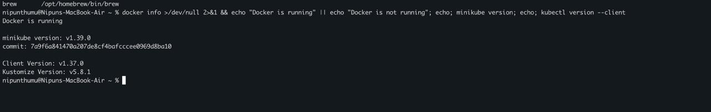
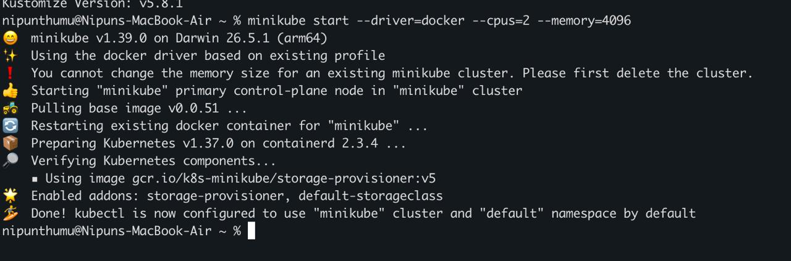
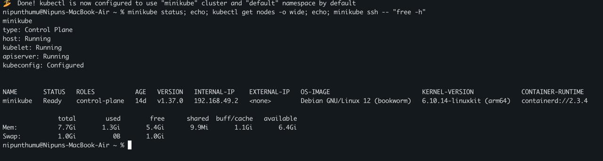
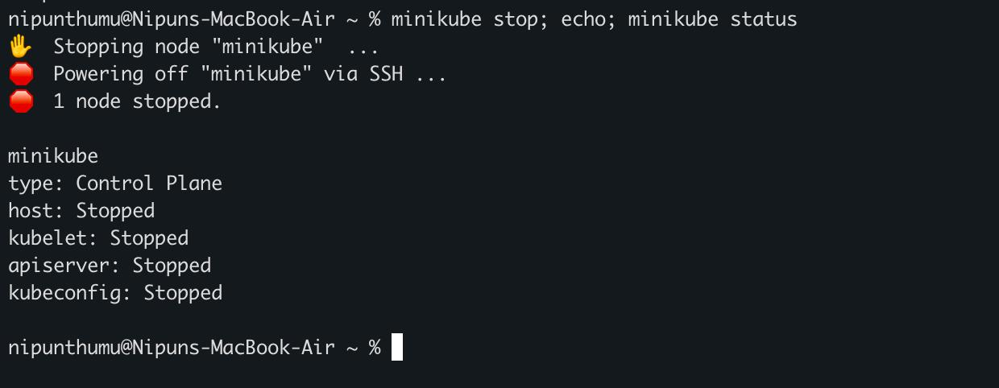

# My Kubernetes Fundamentals Practice

I installed the Kubernetes command-line tools on my Mac, started a local Minikube cluster with Docker, checked the cluster, and stopped it safely.

## Task 1: Verify the tools

I first checked that Docker was running and verified the installed Minikube and kubectl client versions.

```bash
docker info >/dev/null 2>&1 && echo "Docker is running" || echo "Docker is not running"
echo
minikube version
echo
kubectl version --client
```



Docker was running. The output showed Minikube `v1.39.0` and kubectl client `v1.37.0`, so the required tools were ready.

## Task 2: Start the Minikube cluster

I started Minikube with the Docker driver.

```bash
minikube start --driver=docker --cpus=2 --memory=4096
```



Minikube reused my existing Docker-based profile, prepared Kubernetes `v1.37.0`, verified its components, enabled the default addons, and configured kubectl. Because the profile already existed, Minikube kept its existing memory setting instead of applying the new `4096` MB value.

## Task 3: Check the cluster status

I checked the Minikube components, the Kubernetes node, and the memory available inside the Minikube node.

```bash
minikube status
echo
kubectl get nodes -o wide
echo
minikube ssh -- "free -h"
```



The host, kubelet, and API server were running, and kubeconfig was configured. The `minikube` control-plane node was `Ready`, used Kubernetes `v1.37.0`, and had about `7.7 GiB` of memory in total.

## Task 4: Stop the Minikube cluster

I stopped the cluster and then checked its status again.

```bash
minikube stop
echo
minikube status
```



Minikube stopped its node successfully. The final status showed the host, kubelet, API server, and kubeconfig as `Stopped`.

## Task 5: Kubernetes components

A Kubernetes cluster has a control plane and one or more worker nodes.

### Control-plane components

- **kube-apiserver** exposes the Kubernetes API. Commands from kubectl reach the cluster through this API.
- **etcd** stores the cluster's configuration and state as key-value data.
- **kube-scheduler** finds Pods that do not have a node yet and selects a suitable node for them.
- **kube-controller-manager** runs controllers that compare the desired state with the current state and make changes when needed.
- **cloud-controller-manager** connects Kubernetes to a cloud provider when the cluster uses cloud-specific resources.

### Worker-node components

- **kubelet** runs on each node and makes sure the containers described in Pod specifications are running.
- **kube-proxy** maintains network rules so Services can send traffic to the correct Pods.
- **container runtime** runs the containers. My Minikube node used `containerd 2.3.4`.

My Minikube setup used one node for local learning, so the same `minikube` node acted as the control plane and also ran workloads.

## What I understood

- Minikube can create a local Kubernetes cluster using Docker as its driver.
- kubectl uses kubeconfig to communicate with the Kubernetes API server.
- A `Ready` node and running control-plane components show that the cluster can accept workloads.
- The control plane manages cluster state and scheduling, while node components run containers and handle workload networking.
- `minikube stop` preserves the cluster profile and its resources so it can be started again later.

## References

- [Kubernetes Components](https://kubernetes.io/docs/concepts/overview/components/)
- [Minikube documentation](https://minikube.sigs.k8s.io/docs/)
