# My Kubernetes Pods, Controllers, and Deployments Practice

I used my local Minikube cluster to practise Pods, lifecycle failures, controllers, rolling updates, troubleshooting, and common release strategies. The YAML files in this folder are the exact manifests I used during the lab.

## Task 1: Check the cluster health

I started Minikube and checked the tool versions, control plane, CoreDNS, and node state before creating workloads.

```bash
minikube start
echo
minikube version
echo
kubectl version --client
echo
kubectl cluster-info
echo
kubectl get nodes -o wide
```

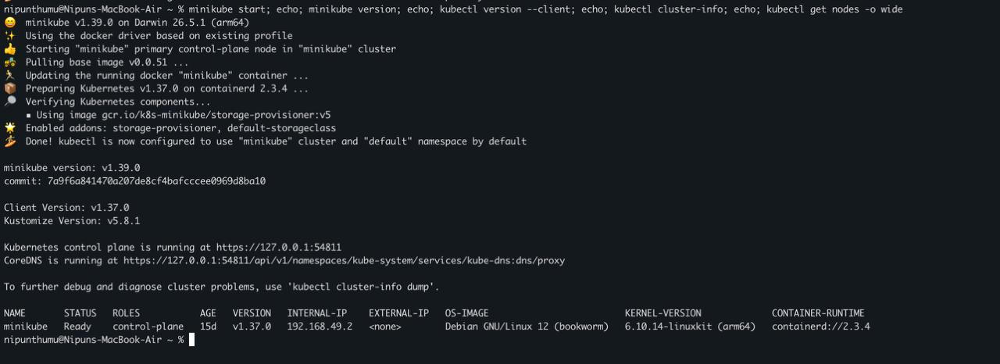

Minikube `v1.39.0` started with Kubernetes `v1.37.0`. The control plane and CoreDNS were reachable, and the `minikube` node was `Ready`.

## Task 2: Create and inspect a Pod

I created a standalone Nginx Pod with the four main manifest fields: `apiVersion`, `kind`, `metadata`, and `spec`.

Manifest: [`pod.yml`](pod.yml)

```bash
kubectl apply -f pod.yml
kubectl wait --for=condition=Ready pod/nginx-pod --timeout=120s
kubectl get pod nginx-pod --show-labels
echo
kubectl get pod nginx-pod -o wide
echo
kubectl logs nginx-pod
kubectl delete -f pod.yml
```

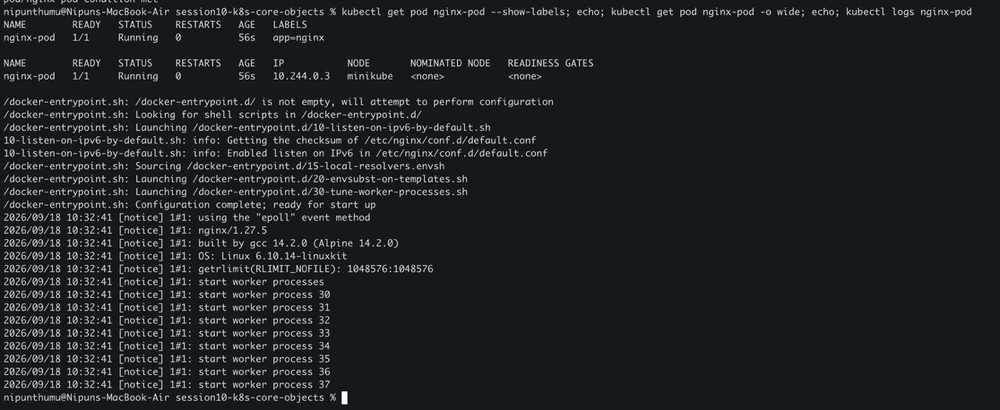

The Pod became `1/1 Running` with the `app=nginx` label. Kubernetes assigned it IP `10.244.0.3` on the Minikube node, and its logs showed that Nginx started successfully.

## Task 3: Observe ImagePullBackOff

I used a nonexistent Nginx tag to see how Kubernetes reports an image pull failure.

Manifest: [`imagepullbackoff.yml`](imagepullbackoff.yml)

```bash
kubectl apply -f imagepullbackoff.yml
kubectl get pod lifecycle-image-error
echo
kubectl describe pod lifecycle-image-error | sed -n '/Events:/,$p'
kubectl delete -f imagepullbackoff.yml
```

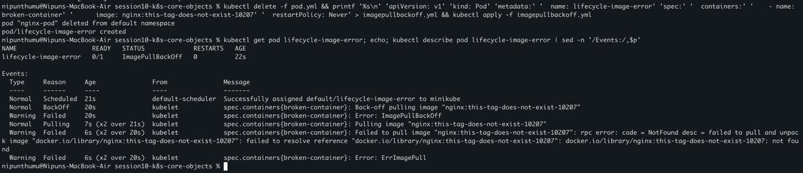

The Pod object was accepted by the API server, but the kubelet could not start its container because the tag did not exist. The status moved through `ErrImagePull` and `ImagePullBackOff`, with longer waits between retries.

## Task 4: Watch a short-lived Pod

I ran a BusyBox container with `restartPolicy: Never` and watched its state change in real time.

Manifest: [`hello.yml`](hello.yml)

```bash
# Terminal 1
kubectl get pods -w --field-selector metadata.name=hello-pod

# Terminal 2
kubectl apply -f hello.yml
kubectl logs hello-pod
kubectl delete -f hello.yml
```

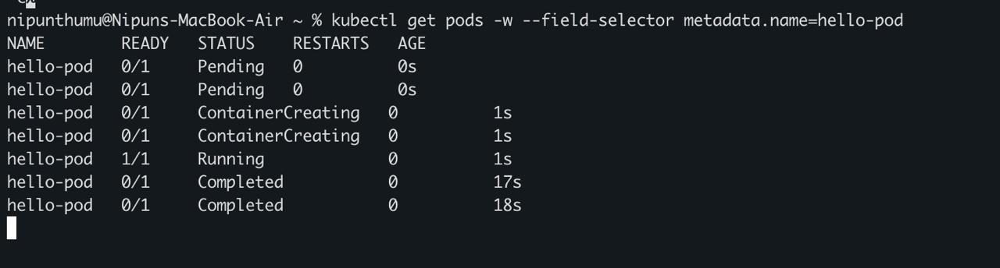

The watch captured `Pending`, `ContainerCreating`, `Running`, and `Completed`. A completed Pod has the Kubernetes phase `Succeeded` because its process exited with code 0.

## Task 5: Study Pod lifecycle states and probes

I tested scheduling failure, repeated crashes, liveness recovery, an init container, and a sidecar container. These were the exact manifests used:

- [`02-pending.yaml`](pod-lifecycle/02-pending.yaml) requests `100Gi`, which cannot be scheduled on my node.
- [`05-crashloopbackoff.yaml`](pod-lifecycle/05-crashloopbackoff.yaml) exits with code 1 and repeatedly restarts.
- [`08-liveness.yaml`](pod-lifecycle/08-liveness.yaml) removes its health file so the liveness probe fails and restarts the container.
- [`11-multi-container.yaml`](pod-lifecycle/11-multi-container.yaml) uses an init container, shared `emptyDir`, app container, and logging sidecar.

```bash
cd pod-lifecycle

kubectl apply -f 02-pending.yaml
kubectl get pod lifecycle-pending
kubectl describe pod lifecycle-pending | grep -E 'FailedScheduling|Insufficient memory'

kubectl apply -f 05-crashloopbackoff.yaml
kubectl get pod lifecycle-crashloop
kubectl logs lifecycle-crashloop --previous

kubectl apply -f 08-liveness.yaml
kubectl get pod lifecycle-liveness
kubectl describe pod lifecycle-liveness | sed -n '/Events:/,$p'
```

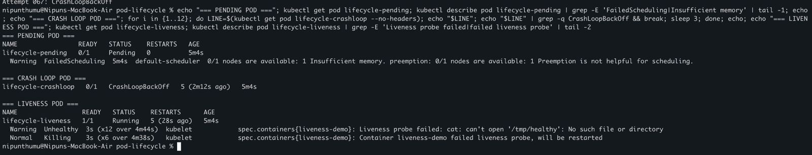

The pending Pod showed `FailedScheduling` because the node had insufficient memory. The crash-loop Pod reached `CrashLoopBackOff`. The liveness Pod stayed Running but had five restarts, and its events showed failed health checks followed by kubelet restarts.

```bash
kubectl apply -f 11-multi-container.yaml
kubectl wait --for=condition=Ready pod/lifecycle-multi-container --timeout=120s
kubectl get pod lifecycle-multi-container
echo
kubectl get pod lifecycle-multi-container \
  -o jsonpath='Init status: {.status.initContainerStatuses[0].state.terminated.reason}{"\n"}'
echo
kubectl logs lifecycle-multi-container -c sidecar --tail=8
```

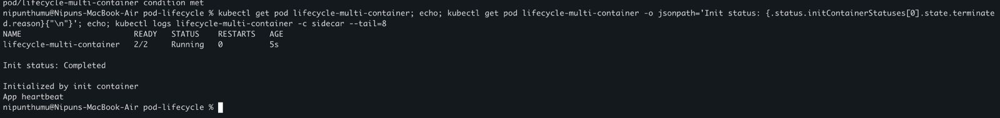

The init container completed before the two main containers started. The Pod then showed `2/2 Running`, and the sidecar read the log written through the shared volume.

The other lifecycle cases in the assignment fit the same model:

| Case | Meaning |
| --- | --- |
| Running | At least one container is still running or starting. |
| Pending | The Pod is accepted but cannot yet be scheduled or started. |
| Succeeded | Every container completed successfully and will not restart. |
| Failed | A container ended unsuccessfully and will not restart. |
| ImagePullBackOff | The kubelet cannot pull the image and delays retries. |
| Readiness probe | Controls whether a running Pod receives Service traffic. |
| Startup probe | Protects a slow-starting app before liveness checks begin. |
| Graceful termination | Gives the process time to handle `SIGTERM` before forced shutdown. |

## Task 6: Compare a ReplicaSet and StatefulSet

### ReplicaSet

I created three Nginx replicas and deleted one Pod manually to test self-healing.

Manifest: [`replicaset.yml`](replicaset.yml)

```bash
kubectl apply -f replicaset.yml
kubectl wait --for=condition=Ready pods -l app=nginx-rs --timeout=120s

echo "=== BEFORE DELETE ==="
kubectl get rs nginx-rs
kubectl get pods -l app=nginx-rs
OLD_POD=$(kubectl get pods -l app=nginx-rs -o jsonpath='{.items[0].metadata.name}')
echo
echo "Deleting $OLD_POD"
kubectl delete pod "$OLD_POD"
sleep 5
echo
echo "=== AFTER DELETE: REPLICASET RESTORES 3 ==="
kubectl get rs nginx-rs
kubectl get pods -l app=nginx-rs
```

The terminal output showed `nginx-rs-6ll89` being deleted and `nginx-rs-n27gn` appearing six seconds later. The ReplicaSet returned to `DESIRED 3`, `CURRENT 3`, and `READY 3`. This proof was captured in the text output from the lab rather than in the attached image set.

### StatefulSet

I then used a headless Service and a StatefulSet with three replicas.

Manifest: [`statefulset.yml`](statefulset.yml)

```bash
kubectl delete -f replicaset.yml
kubectl apply -f statefulset.yml
kubectl rollout status statefulset/mysql --timeout=120s
kubectl get statefulset mysql
echo
kubectl get pods -l app=mysql -o wide
echo
kubectl get service mysql-headless
```

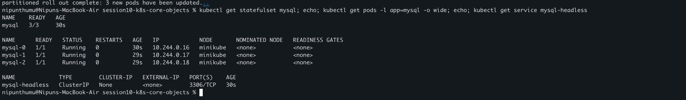

The StatefulSet created `mysql-0`, `mysql-1`, and `mysql-2` in order. The manifest used in this lab demonstrates stable identity and headless-Service discovery, but it does not define `volumeClaimTemplates`, so no persistent volume claims were created.

## Task 7: Run one DaemonSet Pod per node

I deployed a small node agent as a DaemonSet.

Manifest: [`daemonset.yml`](daemonset.yml)

```bash
kubectl apply -f daemonset.yml
kubectl rollout status daemonset/node-exporter --timeout=120s
kubectl get daemonset node-exporter
echo
kubectl get pods -l app=node-exporter -o wide
echo
kubectl logs -l app=node-exporter --tail=3
```

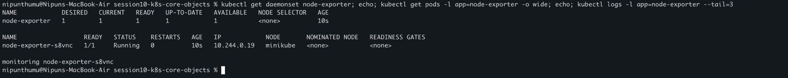

My cluster had one eligible Minikube node, so the DaemonSet showed one desired, current, ready, and available Pod on that node.

## Task 8: Perform a rolling update and rollback

I deployed Nginx `1.26-alpine` as v1, updated it to `1.27-alpine` as v2, and rolled back.

Manifests: [`deployment-v1.yaml`](01-rolling-update/deployment-v1.yaml) and [`deployment-v2.yaml`](01-rolling-update/deployment-v2.yaml)

```bash
cd 01-rolling-update
kubectl apply -f deployment-v1.yaml
kubectl rollout status deployment/app-rolling --timeout=120s
kubectl apply -f deployment-v2.yaml
kubectl rollout status deployment/app-rolling --timeout=120s
kubectl get pods -l app=app-rolling --show-labels
echo
kubectl rollout history deployment/app-rolling
echo
kubectl rollout undo deployment/app-rolling
kubectl rollout status deployment/app-rolling --timeout=120s
echo
kubectl get pods -l app=app-rolling --show-labels
```

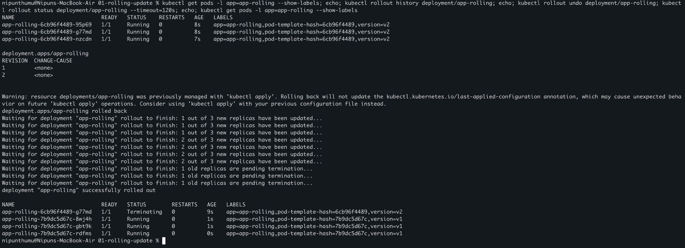

The update produced three healthy v2 Pods and a second revision. The undo created fresh v1 Pods while the old v2 Pod terminated. With `maxSurge: 1` and `maxUnavailable: 0`, Kubernetes could add one extra Pod but kept all three desired replicas available.

## Task 9: Troubleshoot a broken rollout and selector

I first applied a bad image revision to the healthy rolling Deployment. I then tested a Deployment whose selector did not match its Pod-template label.

Manifests: [`broken-image.yaml`](troubleshooting/broken-image.yaml) and [`selector-mismatch.yaml`](troubleshooting/selector-mismatch.yaml)

```bash
cd troubleshooting
kubectl apply -f broken-image.yaml
kubectl rollout status deployment/app-rolling --timeout=10s || true
kubectl get pods -l app=app-rolling

kubectl rollout undo deployment/app-rolling
kubectl rollout status deployment/app-rolling --timeout=120s
kubectl apply -f selector-mismatch.yaml || true
```

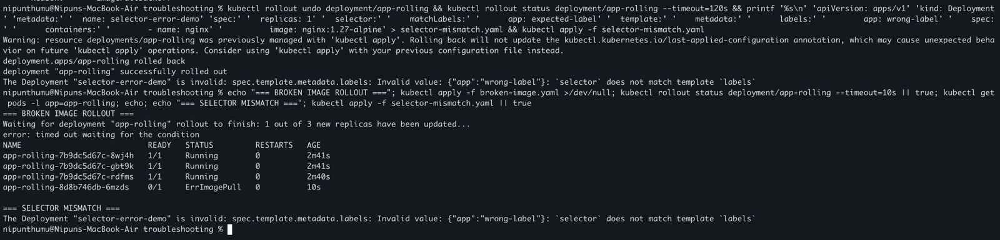

The bad rollout timed out with one new Pod in `ErrImagePull`, while the three old Pods remained Running. The API server rejected the second manifest because `app: expected-label` did not match `app: wrong-label`.

## Task 10: Kubernetes concepts

### containerPort, targetPort, port, and nodePort

- **`containerPort`** documents the port used by a process inside a container. It does not expose the Pod by itself.
- **`targetPort`** is the Pod port to which a Service forwards traffic.
- **`port`** is the port exposed by the Service inside the cluster.
- **`nodePort`** is a port, normally in the `30000-32767` range, opened on each node for external access to a NodePort Service.

A request can follow this path: `nodeIP:nodePort -> Service port -> targetPort -> container process`.

### Labels and selectors

Labels are key-value metadata attached to objects, such as `app: nginx` or `version: v2`. Selectors are filters used by Services and controllers to find objects with matching labels. A Deployment selector must match the labels in its Pod template.

### Four deployment strategies

- **RollingUpdate** replaces old Pods gradually. Surge and availability settings control capacity during the change.
- **Recreate** removes all old Pods before starting new ones. It avoids two versions running together but causes downtime.
- **Blue-Green** keeps two complete environments. A Service selector switches all traffic at once, and switching back gives a fast rollback.
- **Canary** sends part of the traffic to a small new-version group so it can be observed before a full release.

### maxSurge and maxUnavailable

`maxSurge` is how many Pods may exist above the desired replica count during a rolling update. `maxUnavailable` is how many desired Pods may be unavailable.

For four replicas with `maxSurge: 1` and `maxUnavailable: 0`:

- Maximum total Pods: `4 + 1 = 5`
- Minimum available Pods: `4 - 0 = 4`

Percentage values are calculated from the desired replica count. Kubernetes rounds surge percentages up and unavailable percentages down. For example, with 10 replicas and `25%`, surge can be 3 Pods while unavailable can be 2 Pods.

### Resource requests, limits, GB, and GiB

A request is the CPU or memory amount the scheduler uses when deciding where a Pod can fit. A limit is the maximum enforced for a running container. Going above a CPU limit causes throttling; going above a memory limit can cause an OOM kill.

`1 GB` is `1,000,000,000` bytes, while `1 GiB` is `1,073,741,824` bytes. Kubernetes also accepts binary units such as `Mi` and `Gi`.

## Task 11: Switch Blue to Green

I ran two complete environments at the same time and changed the Service selector from Blue to Green.

Manifests: [`deployments.yaml`](02-blue-green/deployments.yaml) and [`service.yaml`](02-blue-green/service.yaml)

```bash
cd 02-blue-green
kubectl apply -f deployments.yaml -f service.yaml
kubectl rollout status deployment/myapp-blue --timeout=120s
kubectl rollout status deployment/myapp-green --timeout=120s
kubectl get pods -l app=myapp --show-labels
kubectl get svc myapp-service -o jsonpath='Selector: {.spec.selector}{"\n"}'
kubectl run curl-blue --rm -i --restart=Never --image=curlimages/curl:8.10.1 -- \
  curl -s http://myapp-service

kubectl patch svc myapp-service -p \
  '{"spec":{"selector":{"app":"myapp","slot":"green"}}}'
kubectl get svc myapp-service -o jsonpath='Selector: {.spec.selector}{"\n"}'
kubectl run curl-green --rm -i --restart=Never --image=curlimages/curl:8.10.1 -- \
  curl -s http://myapp-service
```

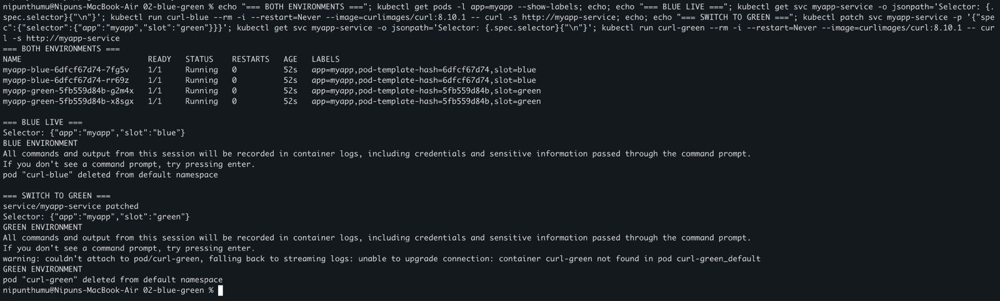

Both Blue and Green stayed healthy. Before the patch, the Service returned `BLUE ENVIRONMENT`; after changing `slot` to `green`, it returned `GREEN ENVIRONMENT`. No mixed-version transition was needed.

## Task 12: Split traffic with a canary

I placed nine stable Pods and one canary Pod behind the same Service.

Manifests: [`deployments.yaml`](03-canary/deployments.yaml) and [`service.yaml`](03-canary/service.yaml)

```bash
cd 03-canary
kubectl apply -f deployments.yaml -f service.yaml
kubectl rollout status deployment/app-stable --timeout=180s
kubectl rollout status deployment/app-canary --timeout=120s
kubectl get pods -l app=myapp-canary -L track
echo
echo "=== 50 REQUEST TRAFFIC SAMPLE ==="
kubectl run canary-test --rm -i --restart=Never --image=curlimages/curl:8.10.1 -- \
  sh -c 'for i in $(seq 1 50); do curl -s http://myapp-canary-service; done' | sort | uniq -c
```

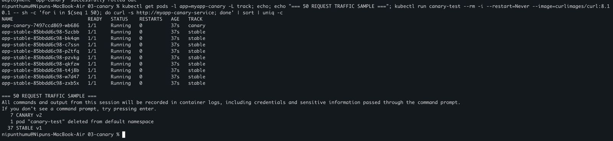

The cluster showed nine stable Pods and one canary Pod. In the completed responses displayed by the 50-request sample, 37 were `STABLE v1` and 7 were `CANARY v2`; kubectl's temporary-Pod messages account for the other output lines. The exact result varies because Service load balancing is not a strict percentage controller.

To increase or cancel the canary, I can change the replica ratio:

```bash
kubectl scale deployment app-canary --replicas=3
kubectl scale deployment app-stable --replicas=7

# Roll back the canary
kubectl scale deployment app-canary --replicas=0
kubectl scale deployment app-stable --replicas=9
```

## Task 13: Demonstrate Recreate downtime

I deployed three v1 replicas with the Recreate strategy. The v2 manifest uses a 12-second init container so the period with no ready application Pods is easy to observe.

Manifests: [`deployment-v1.yaml`](04-recreate/deployment-v1.yaml), [`deployment-v2.yaml`](04-recreate/deployment-v2.yaml), and [`service.yaml`](04-recreate/service.yaml)

```bash
cd 04-recreate
kubectl apply -f deployment-v1.yaml -f service.yaml
kubectl rollout status deployment/app-recreate --timeout=120s

# Terminal 2: keep requesting through the Service
while true; do
  printf '%s ' "$(date +%H:%M:%S)"
  kubectl run recreate-check-$RANDOM --rm -i --restart=Never \
    --image=curlimages/curl:8.10.1 --quiet -- \
    curl -s --max-time 1 http://app-recreate-service 2>/dev/null \
    || echo '[OUTAGE] no ready pods'
  sleep 1
done

# Terminal 1: replace v1 with v2
kubectl apply -f deployment-v2.yaml
kubectl rollout status deployment/app-recreate --timeout=120s
```

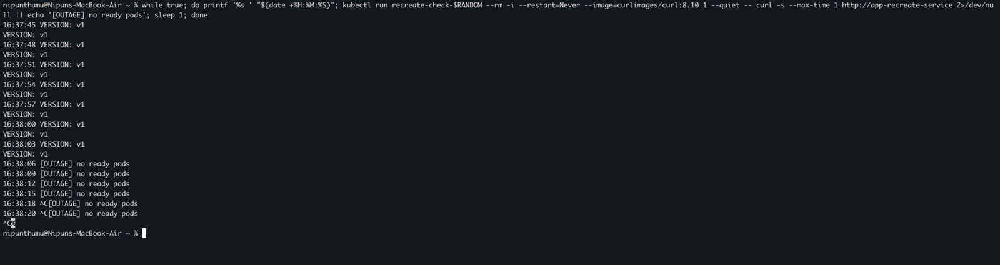

The request loop first returned `VERSION: v1`. Recreate then terminated the old Pods, so several requests reported `[OUTAGE] no ready pods`.

```bash
for i in {1..5}; do
  kubectl run v2-check-$RANDOM --rm -i --restart=Never \
    --image=curlimages/curl:8.10.1 --quiet -- \
    curl -s http://app-recreate-service 2>/dev/null
done
```

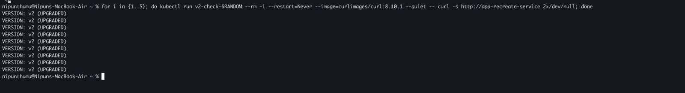

After the new Pods became ready, every check returned `VERSION: v2 (UPGRADED)`. Together, the two images show v1, the deliberate outage, and successful v2 recovery.

## What I understood

- A Pod is the smallest Kubernetes workload unit, while controllers keep groups of Pods in the desired state.
- The API can accept a Pod even when scheduling, image pulling, or container startup later fails.
- Readiness decides whether a Pod receives traffic; liveness can restart an unhealthy container.
- ReplicaSets restore replica count, StatefulSets keep stable identities, and DaemonSets place a Pod on each eligible node.
- Rolling updates protect availability, while Recreate accepts downtime to avoid running two application versions together.
- Blue-Green changes all traffic with a selector, while Canary changes traffic indirectly through the number of Pods in each version.
- Labels and matching selectors connect controllers and Services to the correct Pods.
