# My Kubernetes Networking and Services Practice

I used my local Minikube cluster to practise Kubernetes Service ports, service discovery, internal and external exposure, headless Services, manually managed endpoints, CoreDNS, and workload identity. The YAML files in this folder are the exact manifests I used during the lab.

## Task 1: Trace the four Service ports

I began by drawing the request path from a client to the container.

```bash
clear; printf '%s\n' 'KUBERNETES SERVICE PORT FLOW' '' 'Client Browser' '      |' '      v' 'nodePort: 30080   Node-level external entry' '      |' '      v' 'port: 8080        Stable Service/ClusterIP port' '      |' '      v' 'targetPort: 80     Destination port on selected Pods' '      |' '      v' 'containerPort: 80  Application port declared in the container' '' 'Packet path: nodePort -> port -> targetPort -> containerPort'
```

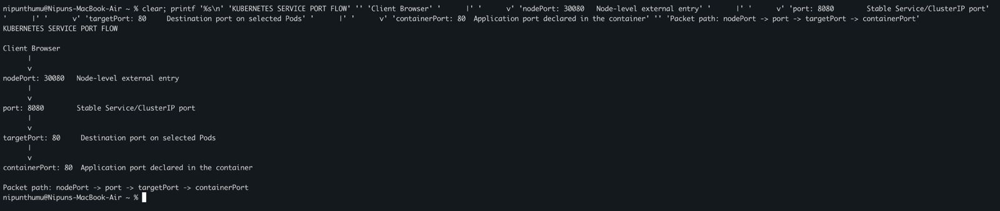

- `containerPort` documents the port used by the process inside the container. It does not expose the Pod by itself.
- `targetPort` is the port on the selected Pods to which the Service forwards traffic.
- `port` is the stable port exposed by the Service.
- `nodePort` opens a port on every node for external access to a NodePort Service.

## Task 2: Create and test a ClusterIP Service

I created three Nginx Pods, a ClusterIP Service on port `8080`, and a client Pod.

Manifest: [`clusterip.yaml`](01-clusterip/clusterip.yaml)

```bash
cd 01-clusterip
kubectl apply -f clusterip.yaml
kubectl rollout status deployment/web-app-clusterip --timeout=120s
kubectl wait --for=condition=Ready pod/curl-client --timeout=120s

kubectl get pods -l app=web-clusterip -o wide
echo
kubectl get service web-service-clusterip
echo
kubectl get endpoints web-service-clusterip
```

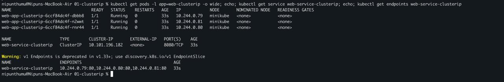

All three Pods were Running at `10.244.0.79`, `10.244.0.81`, and `10.244.0.80`. Those same addresses appeared as Service endpoints on port `80`, while clients used the stable ClusterIP `10.101.196.182:8080`. The warning is expected because the older `Endpoints` API is deprecated in favor of `EndpointSlice`; it did not affect this test.

I then tested both the short Service name and its full Kubernetes DNS name.

```bash
printf '%s\n' '=== SHORT SERVICE NAME ==='
kubectl exec curl-client -- curl -s http://web-service-clusterip:8080 | grep -i '<title>'
echo
printf '%s\n' '=== FULL KUBERNETES FQDN ==='
kubectl exec curl-client -- curl -s http://web-service-clusterip.default.svc.cluster.local:8080 | grep -i '<title>'
```

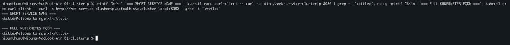

Both requests returned `<title>Welcome to nginx!</title>`. A ClusterIP is intended for traffic from inside the cluster, and CoreDNS lets clients use a stable name instead of changing Pod IPs.

## Task 3: Expose the Pods with NodePort

I reused the same Nginx Pods and exposed them on node port `30080`.

Manifest: [`nodeport.yaml`](02-nodeport/nodeport.yaml)

```bash
cd ../02-nodeport
kubectl apply -f nodeport.yaml
kubectl get service web-service-nodeport
```

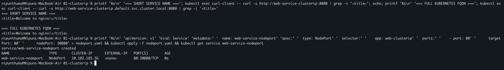

The output showed `80:30080/TCP`: the Service accepts traffic on port `80`, and Kubernetes exposes it through port `30080` on the node.

Because this cluster uses Minikube's Docker driver on macOS, I used Minikube's service command to open a reachable localhost tunnel.

```bash
# Terminal 2: leave this process running
minikube service web-service-nodeport --url

# Terminal 1: use the exact URL printed above
curl -I http://127.0.0.1:56924
```

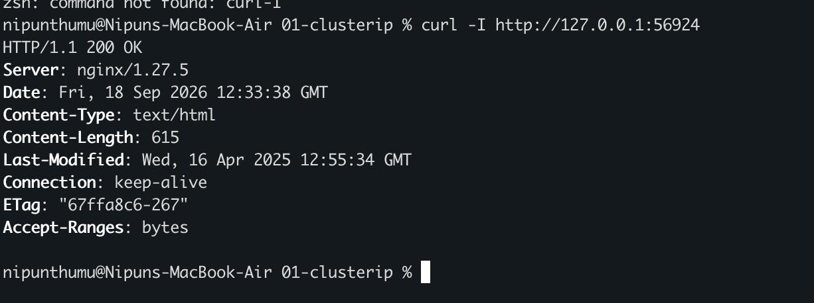

The successful command returned `HTTP/1.1 200 OK` from Nginx `1.27.5`. The `curl-I` line above it was only a typing mistake; `curl -I` was the command that produced the valid response. The localhost port is temporary and can differ on the next run.

## Task 4: Test a LoadBalancer Service

I created a LoadBalancer Service for the same three backend Pods.

Manifest: [`loadbalancer.yaml`](03-loadbalancer/loadbalancer.yaml)

```bash
cd ../03-loadbalancer
kubectl apply -f loadbalancer.yaml
kubectl get svc web-service-loadbalancer

# Terminal 2: leave this process running
sudo minikube tunnel

# Terminal 1
kubectl get svc web-service-loadbalancer
echo
EXTERNAL_IP=$(kubectl get svc web-service-loadbalancer -o jsonpath='{.status.loadBalancer.ingress[0].ip}')
echo "External IP: $EXTERNAL_IP"
curl -I "http://$EXTERNAL_IP"
```

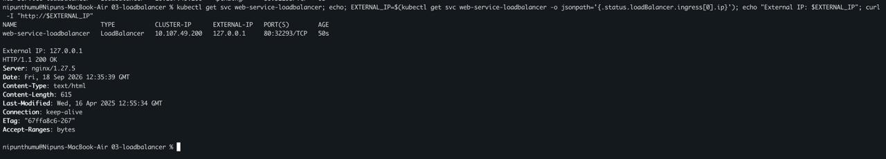

Before the tunnel, `EXTERNAL-IP` was `<pending>`. With `minikube tunnel` running, it became `127.0.0.1`; Kubernetes also assigned NodePort `32293`. The HTTP request returned `200 OK`. This local tunnel simulates the route that a cloud load-balancer integration normally provides.

## Task 5: Create an ExternalName alias

I created a Service that maps a cluster-local name to `api.github.com`, plus a BusyBox DNS client.

Manifest: [`externalname.yaml`](04-externalname/externalname.yaml)

```bash
cd ../04-externalname
kubectl apply -f externalname.yaml
kubectl wait --for=condition=Ready pod/dns-test-client --timeout=120s

kubectl get svc external-database-service
echo
kubectl get endpoints external-database-service
echo
kubectl exec dns-test-client -- nslookup external-database-service
```

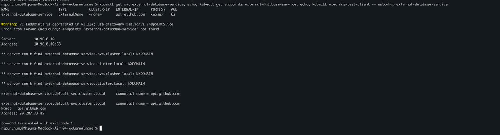

The Service had type `ExternalName`, no ClusterIP, and no endpoint object. That is expected: DNS returned `external-database-service.default.svc.cluster.local` as a canonical name for `api.github.com`, which resolved to `20.207.73.85` during the test. The address is not permanent. BusyBox printed NXDOMAIN results for unsuccessful search-suffix attempts and exited with code 1, but the final CNAME and address prove that the intended lookup succeeded.

## Task 6: Use a headless Service with a StatefulSet

I created a headless Service, a three-replica StatefulSet, and a DNS client.

Manifest: [`headless.yaml`](05-headless/headless.yaml)

```bash
cd ../05-headless
kubectl apply -f headless.yaml
kubectl rollout status statefulset/web-stateful --timeout=180s
kubectl wait --for=condition=Ready pod/headless-client --timeout=120s

kubectl get svc web-headless
echo
kubectl get pods -l app=web-stateful -o wide
echo
kubectl exec headless-client -- nslookup web-headless
```

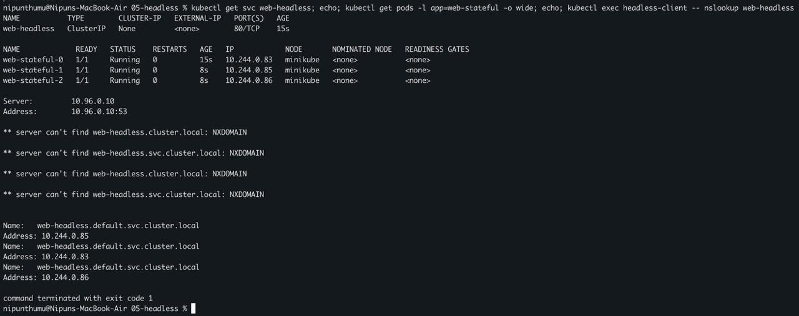

`clusterIP: None` made this a headless Service. The StatefulSet created stable ordinal names `web-stateful-0`, `web-stateful-1`, and `web-stateful-2`. DNS returned their three Pod IPs directly rather than one virtual Service IP. BusyBox again showed failed search candidates and exit code 1, but the successful records for all three Pods are visible.

## Task 7: Route a selectorless Service to a manual endpoint

I created a Service with no selector and supplied its backend manually as `1.1.1.1:80`.

Manifest: [`manual-endpoints.yaml`](06-manual-endpoints/manual-endpoints.yaml)

```bash
cd ../06-manual-endpoints
kubectl apply -f manual-endpoints.yaml

kubectl get svc manual-external-service -o wide
echo
kubectl get endpoints manual-external-service -o wide
echo
kubectl describe svc manual-external-service | grep -E 'Selector|Endpoints'
echo
kubectl exec headless-client -- wget -S -O /dev/null -T 10 http://manual-external-service 2>&1 | head -12
```

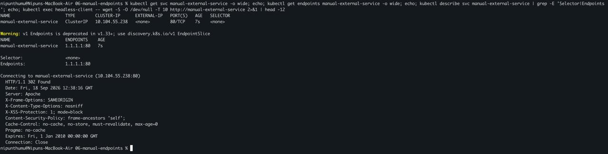

The Service showed `SELECTOR <none>` and the manually maintained endpoint `1.1.1.1:80`. The request used the Kubernetes Service name, reached Cloudflare at that address, and received `HTTP/1.1 302 Found`. The redirect is a valid external response, not a Kubernetes failure. The deprecation warning applies to the manually created `Endpoints` object; a current production design should prefer `EndpointSlice`.

## Task 8: Inspect CoreDNS and FQDN behavior

I inspected the DNS configuration inside the client Pod and the cluster DNS components.

```bash
cd ../07-coredns-fqdn
kubectl exec headless-client -- cat /etc/resolv.conf
echo
kubectl get svc kube-dns -n kube-system -o wide
echo
kubectl get pods -n kube-system -l k8s-app=kube-dns -o wide
```

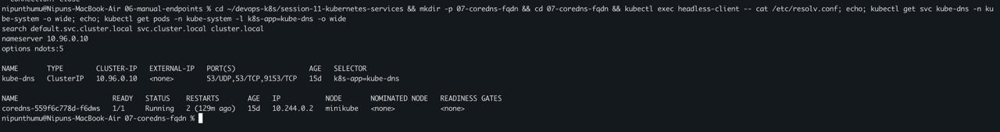

The Pod used nameserver `10.96.0.10`, which matched the `kube-dns` ClusterIP. Its search list was `default.svc.cluster.local`, `svc.cluster.local`, and `cluster.local`, with `options ndots:5`. The CoreDNS Pod was Running on the Minikube node.

I compared a complete Service FQDN, a partial name, and a short Service name.

```bash
kubectl exec headless-client -- nslookup web-headless.default.svc.cluster.local
echo
kubectl exec headless-client -- nslookup web-headless.default
echo
kubectl exec headless-client -- nslookup web-headless
```

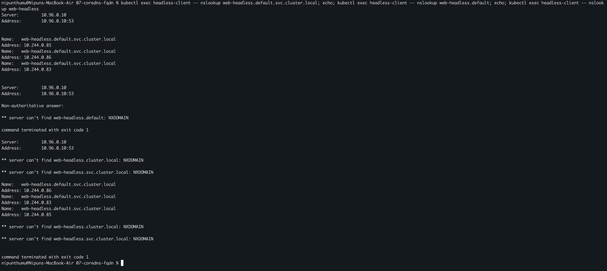

The full FQDN returned all three Pod IPs immediately. The partial name `web-headless.default` failed because it is not the complete cluster DNS name, and the search list does not transform it into the intended name. The short name `web-headless` succeeded after the resolver applied the namespace search suffix and returned all three addresses. BusyBox reported exit code 1 after showing both failed search attempts and successful answers.

### What `ndots:5` means

A resolver normally tries a name as absolute first only when it contains at least the configured number of dots. With `ndots:5`, common Kubernetes names have fewer than five dots, so the resolver tries each search suffix before trying the name as written.

- `web-headless` has zero dots and is expanded through the search list. In the `default` namespace, `web-headless.default.svc.cluster.local` succeeds.
- `web-headless.default` has one dot. Appending the first suffix creates `web-headless.default.default.svc.cluster.local`, which is not the intended Service FQDN.
- `web-headless.default.svc.cluster.local` has four dots, so it can still be tried with search suffixes before the final as-written lookup unless the trailing-dot form `web-headless.default.svc.cluster.local.` is used.

This behavior makes short in-cluster names convenient, but repeated search attempts can add DNS queries and latency. For frequent cross-namespace or external lookups, a complete name, and where supported a trailing dot, avoids ambiguous expansion.

## Task 9: Compare Deployment and StatefulSet identity

I created a two-replica stateless Deployment and deleted one Deployment Pod and `web-stateful-0`.

Saved declarative equivalent of the imperative create command: [`stateless-web.yaml`](08-workload-identity/stateless-web.yaml)

```bash
cd ../08-workload-identity
kubectl create deployment stateless-web --image=nginx:1.25-alpine --replicas=2
kubectl rollout status deployment/stateless-web --timeout=120s

OLD_DEPLOY=$(kubectl get pods -l app=stateless-web -o jsonpath='{.items[0].metadata.name}')
echo "BEFORE:"
kubectl get pods -l app=stateless-web
kubectl get pods -l app=web-stateful
kubectl delete pod "$OLD_DEPLOY" web-stateful-0
kubectl wait --for=condition=Ready pod -l app=stateless-web --timeout=120s
kubectl wait --for=condition=Ready pod/web-stateful-0 --timeout=120s
echo
echo "AFTER deleting $OLD_DEPLOY and web-stateful-0:"
kubectl get pods -l app=stateless-web
kubectl get pods -l app=web-stateful
```

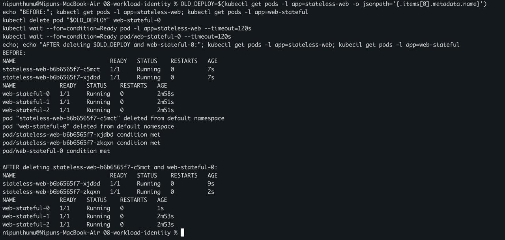

The Deployment replaced deleted Pod `stateless-web-b6b6565f7-c5mct` with the new random identity `stateless-web-b6b6565f7-zkqxn`. The StatefulSet recreated the same ordinal identity, `web-stateful-0`. This lab tested naming and network identity only; the StatefulSet manifest has no `volumeClaimTemplates`, so it does not demonstrate persistent storage.

## Task 10: Choose the right workload controller

| Question | Deployment | StatefulSet | DaemonSet |
| --- | --- | --- | --- |
| Main use | Interchangeable stateless replicas | Stateful replicas that need stable identity or ordered operations | One Pod on every eligible node |
| Pod names | Generated and replaceable | Stable ordinal names such as `web-0` | Generated from the DaemonSet on each node |
| Scaling model | Any replica count | Ordered ordinal replicas | Follows eligible node count |
| Update behavior | RollingUpdate or Recreate | Ordered rolling update by default | RollingUpdate or OnDelete |
| Storage pattern | Usually shared/external or ephemeral | Commonly one persistent claim per replica | Often node-local paths, sockets, or logs |
| Network identity | Service gives the stable identity | Headless Service can expose stable Pod DNS identities | Usually reached as node agents, not as a replica pool |
| Good examples | Web APIs, front ends, workers | Databases, brokers, clustered systems | Log collectors, monitoring agents, CNI/node helpers |

My selection rule is:

1. If every replica is interchangeable, I use a Deployment.
2. If each replica needs a stable ordinal, stable DNS identity, ordered start/stop, or its own persistent volume, I use a StatefulSet.
3. If the application must run on every eligible node, I use a DaemonSet.

## Task 11: Choose a Service type and account for cost

```text
Does the workload need a stable network entry point?
|
+-- No -> Do not create a Service.
|
+-- Yes
    |
    +-- Is it only for clients inside the cluster?
    |   |
    |   +-- One virtual IP and load balancing -> ClusterIP
    |   +-- Direct per-Pod DNS/discovery -> Headless Service
    |
    +-- Does it alias an external DNS name with no proxying? -> ExternalName
    |
    +-- Does it need an external entry point?
        |
        +-- Local lab or direct node-level access is acceptable -> NodePort
        +-- Managed external load balancer is required -> LoadBalancer
        +-- HTTP/HTTPS routing for several apps is required -> ClusterIP Services
            behind an Ingress or Gateway
```

Cost is part of the choice:

- A ClusterIP and a headless Service do not ask a cloud provider to create an external load balancer.
- NodePort normally does not create a managed load balancer, but it exposes a high port on every node and needs separate routing, firewall, and TLS planning.
- Each cloud `LoadBalancer` Service can provision billable infrastructure. One load balancer per application can become expensive, so several HTTP services are often placed behind one Ingress or Gateway when that design fits.
- ExternalName only publishes a DNS CNAME. The external service it points to can still have its own network and vendor costs.
- A selectorless Service makes Kubernetes route to endpoints I maintain. I am responsible for their health and lifecycle.

## Task 12: Understand Minikube Docker-driver access

My Minikube node runs inside Docker on macOS. The node address belongs to a Docker network that the host may not route to directly, so `minikube ip` plus a NodePort is not always reachable from the Mac.

- `minikube service <name> --url` creates a temporary localhost tunnel to a Service. The command must remain running, and the printed localhost port can change each time.
- `minikube tunnel` creates host routes for LoadBalancer Services. It normally needs administrator privileges and must remain running.
- A LoadBalancer Service can stay at `EXTERNAL-IP <pending>` until that tunnel or a real cloud load-balancer controller supplies an address.
- The LoadBalancer test showing `127.0.0.1` is local Minikube behavior. It is not a public Internet address.
- On a cloud cluster, NodePort and LoadBalancer reachability also depends on node networking, firewalls or security groups, and the cloud provider integration.

## What I understood

- A Service separates a stable network entry point from replaceable Pod IPs.
- Selectors connect a Service to matching Pods, while EndpointSlices record the current backends.
- ClusterIP is the default internal Service, NodePort exposes a node-level port, and LoadBalancer requests external infrastructure.
- ExternalName is a DNS alias rather than a traffic proxy.
- A headless Service returns backend addresses directly and works well with StatefulSet identities.
- Services without selectors can represent manually managed backends, but Kubernetes will not discover or repair those endpoints for me.
- CoreDNS, search domains, and `ndots:5` explain why short names work and why a partly qualified name can fail.
- Deployment Pods are replaceable, StatefulSet Pods keep ordinal identity, and DaemonSets follow nodes.
- Local Minikube tunnels are development access paths, not evidence of a public cloud load balancer.

## References

- [Kubernetes Services](https://kubernetes.io/docs/concepts/services-networking/service/)
- [DNS for Services and Pods](https://kubernetes.io/docs/concepts/services-networking/dns-pod-service/)
- [Kubernetes Deployments](https://kubernetes.io/docs/concepts/workloads/controllers/deployment/)
- [Kubernetes StatefulSets](https://kubernetes.io/docs/concepts/workloads/controllers/statefulset/)
- [Kubernetes DaemonSets](https://kubernetes.io/docs/concepts/workloads/controllers/daemonset/)
- [Minikube: Accessing apps](https://minikube.sigs.k8s.io/docs/handbook/accessing/)
- [Minikube service command](https://minikube.sigs.k8s.io/docs/commands/service/)
- [Minikube tunnel command](https://minikube.sigs.k8s.io/docs/commands/tunnel/)
