# My Kubernetes ConfigMaps, Secrets and Ingress Practice

I used my local Minikube cluster on macOS with the Docker driver to practise configuration, Secrets, Ingress routing, TLS, and safe cleanup. The YAML and shell files in this folder are the exact files I used in the lab. The username and password shown here are fake lab values.

## Task 1: Create and inspect a five-key ConfigMap

Manifest: [`configmap.yaml`](01-configmap/configmap.yaml)

```bash
cd 01-configmap
kubectl apply -f configmap.yaml
kubectl get configmap yatri-app-config
echo
kubectl describe configmap yatri-app-config
echo
kubectl get configmap yatri-app-config -o jsonpath='{.data}'; echo
```

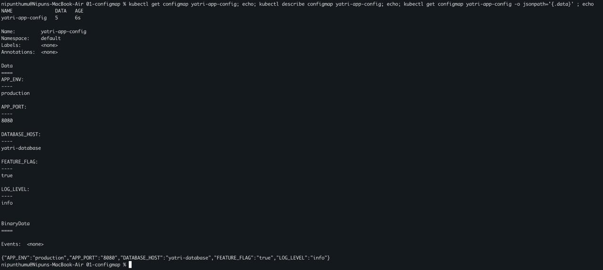

The ConfigMap was created with `APP_ENV`, `APP_PORT`, `LOG_LEVEL`, `FEATURE_FLAG`, and `DATABASE_HOST`. This separated non-confidential application settings from the container image.

## Task 2: Update a ConfigMap and restart the Pod

Manifest: [`backend.yaml`](02-configmap-update/backend.yaml)

```bash
cd ../02-configmap-update
kubectl apply -f backend.yaml
kubectl rollout status deployment/yatri-backend --timeout=120s

POD=$(kubectl get pod -l app=yatri-backend -o jsonpath='{.items[0].metadata.name}')
echo "BEFORE PATCH - $POD:"; kubectl exec "$POD" -- printenv LOG_LEVEL
kubectl patch configmap yatri-app-config --type merge -p '{"data":{"LOG_LEVEL":"debug"}}'
echo "CONFIGMAP NOW:"; kubectl get configmap yatri-app-config -o jsonpath='{.data.LOG_LEVEL}'; echo
echo "EXISTING POD STILL:"; kubectl exec "$POD" -- printenv LOG_LEVEL
```

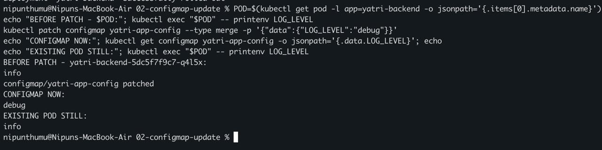

The ConfigMap changed from `info` to `debug`, but the existing Pod still printed `info`. Environment variables are set when the container starts; changing their source does not rewrite the environment of a running process.

```bash
kubectl rollout restart deployment/yatri-backend
kubectl rollout status deployment/yatri-backend --timeout=120s
kubectl get pods -l app=yatri-backend --sort-by=.metadata.creationTimestamp
echo
NEW_POD=$(kubectl get pods -l app=yatri-backend --sort-by=.metadata.creationTimestamp -o name | tail -1)
echo "NEWEST POD - $NEW_POD:"; kubectl exec "$NEW_POD" -- printenv LOG_LEVEL
```

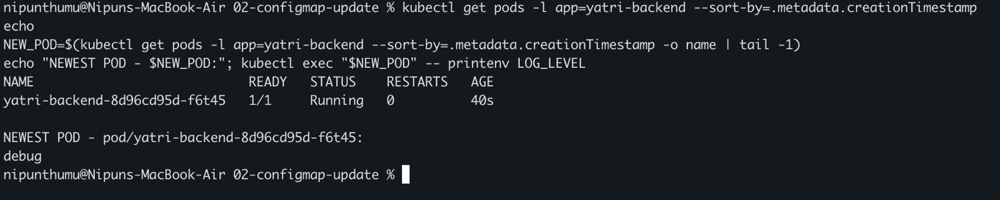

My first post-restart command selected the old terminating Pod, so it still showed `info`. I corrected the check by sorting Pods by creation time and selecting the newest one. The new Pod `yatri-backend-8d96cd95d-f6t45` printed `debug`.

## Task 3: Create, inspect, and decode a Secret

Safe script: [`create-secret.sh`](03-secrets/create-secret.sh)

```bash
cd ../03-secrets
./create-secret.sh
kubectl get secret yatri-db-secret
echo
kubectl describe secret yatri-db-secret
echo
echo "ENCODED USERNAME:"
kubectl get secret yatri-db-secret -o jsonpath='{.data.DB_USERNAME}'; echo
echo "DECODED USERNAME:"
kubectl get secret yatri-db-secret -o jsonpath='{.data.DB_USERNAME}' | base64 --decode; echo
echo "DECODED LAB PASSWORD:"
kubectl get secret yatri-db-secret -o jsonpath='{.data.DB_PASSWORD}' | base64 --decode; echo
```

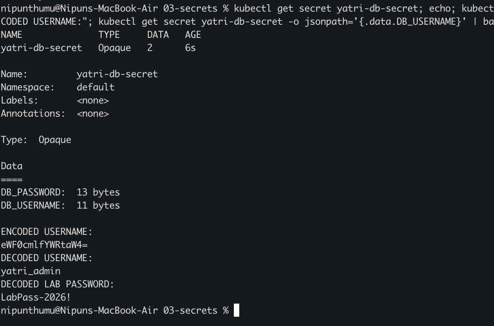

The Opaque Secret contained two keys. The test also proved that base64 is only an encoding: anyone who can read the Secret data can decode it. I did not save the generated Secret manifest in this repository.

## Task 4: Compare `echo` and `echo -n` for base64

```bash
VALUE_WITH_NEWLINE=$(echo 'LabPass-2026!' | base64)
VALUE_WITHOUT_NEWLINE=$(echo -n 'LabPass-2026!' | base64)
echo "echo encoded:    $VALUE_WITH_NEWLINE"
echo "echo -n encoded: $VALUE_WITHOUT_NEWLINE"
echo; echo "Decoded bytes from echo:"
echo "$VALUE_WITH_NEWLINE" | base64 --decode | od -An -t x1
echo "Decoded bytes from echo -n:"
echo "$VALUE_WITHOUT_NEWLINE" | base64 --decode | od -An -t x1
echo; echo "Visible decoded forms:"
echo "$VALUE_WITH_NEWLINE" | base64 --decode | cat -e; echo
echo "$VALUE_WITHOUT_NEWLINE" | base64 --decode | cat -e; echo
```

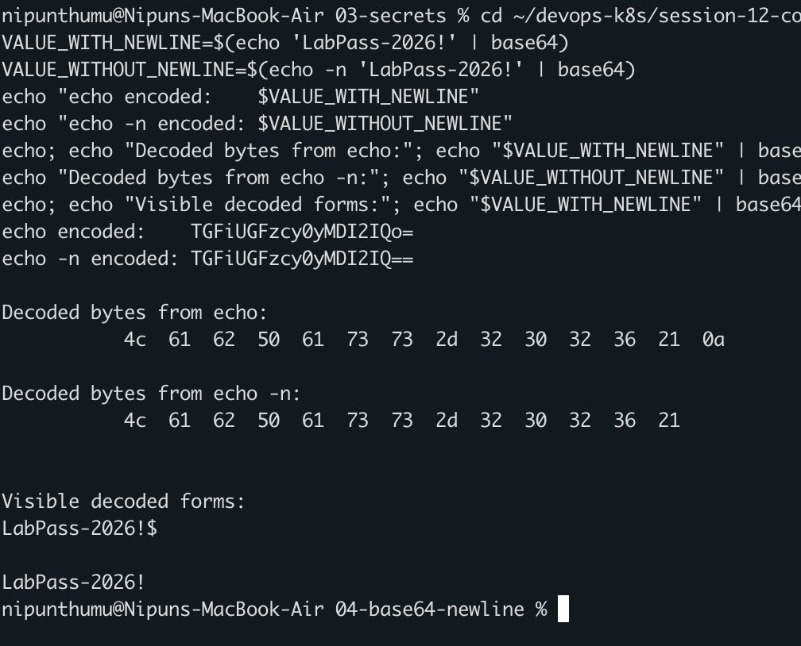

Plain `echo` added byte `0a`, which is a newline. `echo -n` did not. That invisible extra byte can make a password or token fail even when it looks correct on screen.

## Task 5: Design enterprise secret management

I would not keep production secret values in Git or type them into reusable manifests. I would use this flow:

```text
Managed secret vault
(AWS Secrets Manager, Azure Key Vault, Google Secret Manager, or Vault)
        |
        | workload identity + narrowly scoped access policy
        v
External Secrets Operator in the cluster
        |
        | creates/refreshes only the required values
        v
Kubernetes Secret
(encryption at rest enabled for API data)
        |
        | namespace RBAC + least-privilege ServiceAccount
        v
Application Pod
(mount only the values that this workload needs)
```

The managed vault is the source of truth and supports central access control, rotation, and audit logs. External Secrets Operator synchronizes the approved values instead of storing plaintext in Git. Kubernetes API data should be encrypted at rest, and RBAC should restrict who can read Secrets. Each workload should have its own ServiceAccount and receive only the values it needs. Rotation should update the Kubernetes Secret and restart or reload the application when required.

Base64 does not secure a Secret, and a Kubernetes Secret alone is not a full enterprise secret-management system. The Kubernetes documentation recommends encryption at rest and least-privilege access for confidential data.

## Task 6: Inject a ConfigMap and Secret together

Manifest: [`combined.yaml`](06-combined-injection/combined.yaml)

```bash
cd ../06-combined-injection
kubectl apply -f combined.yaml
kubectl rollout status deployment/yatri-full-backend --timeout=120s
POD=$(kubectl get pod -l app=yatri-full-backend -o jsonpath='{.items[0].metadata.name}')
kubectl get pod "$POD" -o wide
echo
kubectl exec "$POD" -- sh -c 'printenv | grep -E "^(APP_ENV|APP_PORT|LOG_LEVEL|FEATURE_FLAG|DATABASE_HOST|DB_USERNAME|DB_PASSWORD)=" | sort'
```

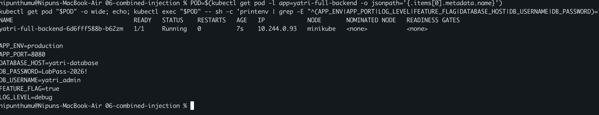

The Pod was Running and contained all seven variables: five from the ConfigMap and two from the Secret. This worked because `envFrom` can reference both sources.

## Task 7: Explain an Ingress resource and controller

```text
Client request
      |
      v
Ingress controller Service
      |
      v
NGINX Ingress controller  <---- watches ----  Ingress resource
      |                                      (host/path/TLS rules)
      v
Kubernetes Service
      |
      v
Application Pods
```

An **Ingress resource** is a declarative Kubernetes API object. It stores desired host, path, backend, and TLS rules, but does not serve traffic by itself.

An **Ingress controller** is the running implementation. It watches Ingress resources and configures a reverse proxy or load balancer, such as NGINX, to enforce those rules. Creating an Ingress without a matching controller leaves rules with nothing to implement them.

## Task 8: Enable the Minikube NGINX Ingress controller

```bash
minikube addons enable ingress
kubectl wait --namespace ingress-nginx --for=condition=Ready pod \
  --selector=app.kubernetes.io/component=controller --timeout=180s
kubectl get pods -n ingress-nginx -o wide
echo
kubectl get svc -n ingress-nginx
minikube addons list | grep ingress
```

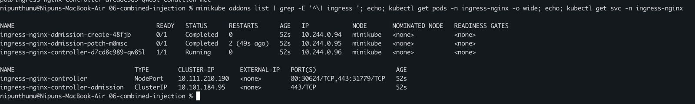

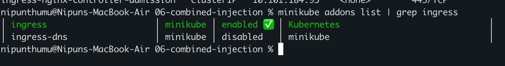

The controller Pod reached `1/1 Running`, its Services were present, and Minikube showed the `ingress` addon as enabled.

## Task 9: Map local hostnames

I first checked for old entries so I would not add duplicates.

```bash
MINIKUBE_IP=$(minikube ip)
echo "Minikube IP: $MINIKUBE_IP"
grep -nE 'yatri\.local|api\.yatri\.local' /etc/hosts || echo "No existing Yatri host entries"
echo "$MINIKUBE_IP yatri.local api.yatri.local" | sudo tee -a /etc/hosts
grep -nE 'yatri\.local|api\.yatri\.local' /etc/hosts
echo
dscacheutil -q host -a name yatri.local
```

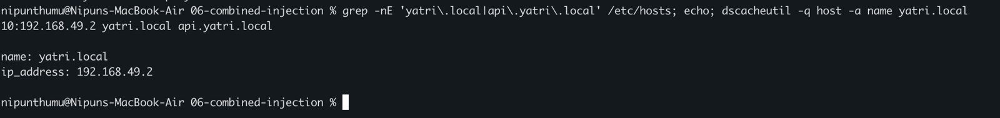

Both names mapped to the observed Minikube IP `192.168.49.2`. The address belongs to this lab run and may change after recreating the cluster.

## Task 10: Build path-based Ingress routing

Manifest: [`path-ingress.yaml`](10-path-ingress/path-ingress.yaml)

```bash
cd ../10-path-ingress
kubectl apply -f path-ingress.yaml
kubectl rollout status deployment/yatri-frontend --timeout=180s
kubectl rollout status deployment/yatri-api --timeout=180s
kubectl get deploy,svc,ingress | grep -E 'NAME|yatri'
echo
curl -s http://yatri.local/; echo
curl -s http://yatri.local/api/; echo
```

The Deployments, Services, Ingress, Pods, and endpoints were healthy, but direct hostname requests were not yet reaching these routes.

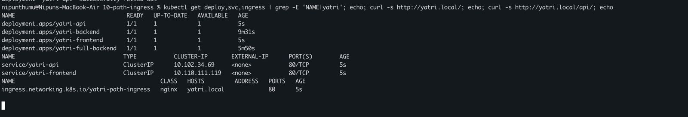

I tried `minikube tunnel`. It first failed because files below `~/.minikube` were owned by root. I applied Minikube's correction and restarted it:

```bash
sudo chown -R "$USER" "$HOME/.minikube"
chmod -R u+wrx "$HOME/.minikube"
minikube tunnel
```

After changing the controller Service to `LoadBalancer`, the tunnel exposed `127.0.0.1`:

```bash
kubectl patch svc ingress-nginx-controller -n ingress-nginx -p '{"spec":{"type":"LoadBalancer"}}'
sudo sed -i '' '/yatri\.local/d' /etc/hosts
echo '127.0.0.1 yatri.local api.yatri.local' | sudo tee -a /etc/hosts
```

Port 80 on the Mac was already serving a different NGINX route. The response was not from the new Yatri Pods, so I treated it as a diagnostic rather than success evidence.

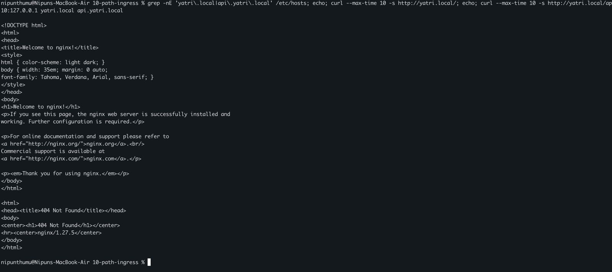

For Minikube's Docker driver on macOS, I used its temporary localhost Service proxy instead:

```bash
# Keep this terminal open
minikube service ingress-nginx-controller -n ingress-nginx --url
# Observed HTTP and HTTPS URLs:
# http://127.0.0.1:57946
# https://127.0.0.1:57947

# In another terminal
INGRESS_URL=http://127.0.0.1:57946
curl --max-time 10 -s -H 'Host: yatri.local' "$INGRESS_URL/"; echo
curl --max-time 10 -s -H 'Host: yatri.local' "$INGRESS_URL/api/"; echo
```

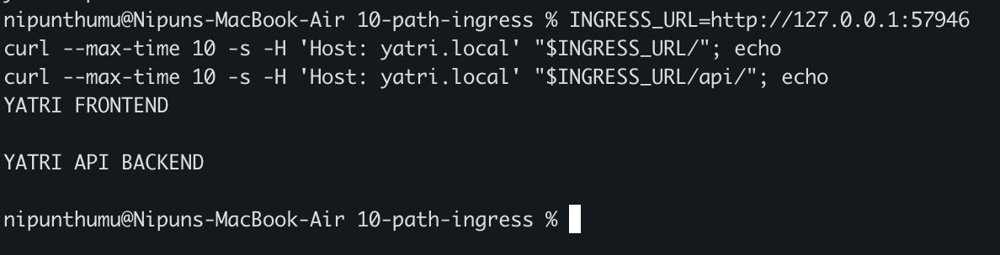

The same Ingress entry point returned `YATRI FRONTEND` for `/` and `YATRI API BACKEND` for `/api/`. The proxy ports are temporary and can differ on another run.

## Task 11: Add host-based routing

Manifest: [`host-ingress.yaml`](11-host-ingress/host-ingress.yaml)

```bash
cd ../11-host-ingress
kubectl apply -f host-ingress.yaml
kubectl get ingress yatri-host-ingress
echo
curl --max-time 10 -s -H 'Host: yatri.local' "$INGRESS_URL/"; echo
curl --max-time 10 -s -H 'Host: api.yatri.local' "$INGRESS_URL/"; echo
```

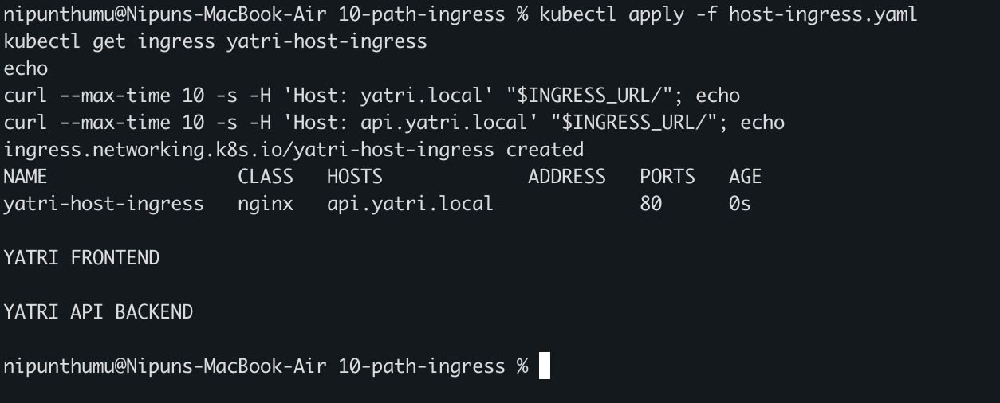

With the proxy still running, `yatri.local` returned the frontend and `api.yatri.local` returned the API. The destination changed according to the HTTP `Host` header.

## Task 12: Combine host and path rules

Manifest: [`hybrid-ingress.yaml`](12-hybrid-ingress/hybrid-ingress.yaml)

```bash
cd ../12-hybrid-ingress
kubectl delete ingress yatri-path-ingress yatri-host-ingress
kubectl apply -f hybrid-ingress.yaml
kubectl get ingress yatri-hybrid-ingress
echo
kubectl describe ingress yatri-hybrid-ingress
```

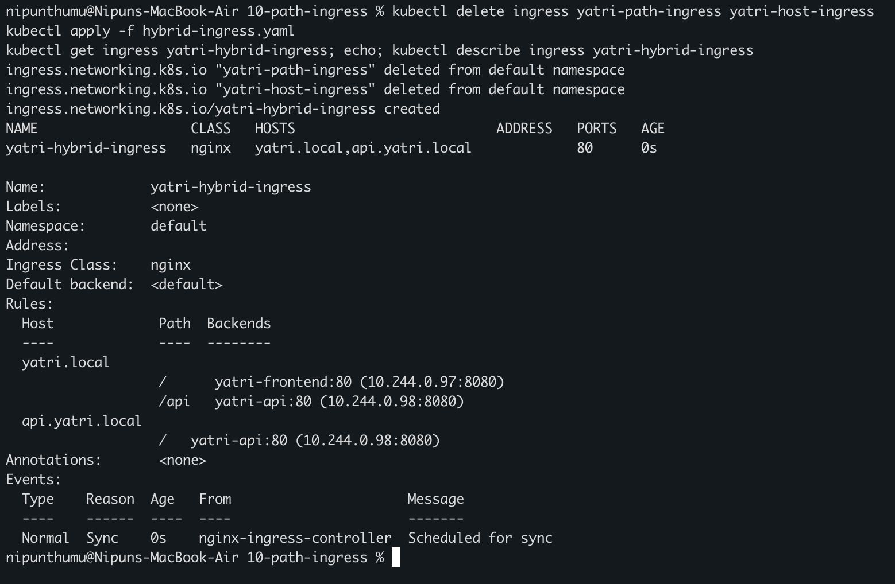

I removed the earlier Ingress objects to avoid overlapping rules. The hybrid object showed three routes: `/` and `/api` for `yatri.local`, and `/` for `api.yatri.local`.

## Task 13: Add TLS with a self-signed certificate

The certificate and private key stay local. [`13-tls/.gitignore`](13-tls/.gitignore) excludes `*.crt` and `*.key`.

```bash
cd ../13-tls
openssl req -x509 -nodes -days 365 -newkey rsa:2048 \
  -keyout tls.key -out tls.crt \
  -subj '/CN=yatri.local/O=Yatri Lab' \
  -addext 'subjectAltName=DNS:yatri.local,DNS:api.yatri.local'
kubectl create secret tls yatri-tls --cert=tls.crt --key=tls.key \
  --dry-run=client -o yaml | kubectl apply -f -
kubectl patch ingress yatri-hybrid-ingress --type merge \
  -p '{"spec":{"tls":[{"hosts":["yatri.local","api.yatri.local"],"secretName":"yatri-tls"}]}}'
kubectl get secret yatri-tls
echo
kubectl get ingress yatri-hybrid-ingress
echo
kubectl describe ingress yatri-hybrid-ingress | grep -A3 TLS
```

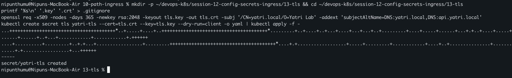

The Secret had type `kubernetes.io/tls` with two data items. The Ingress listed both hosts on ports 80 and 443, with `yatri-tls` terminating TLS.

```bash
HTTPS_URL=https://127.0.0.1:57947
curl -k --max-time 10 -s -H 'Host: yatri.local' "$HTTPS_URL/"; echo
curl -k --max-time 10 -s -H 'Host: api.yatri.local' "$HTTPS_URL/"; echo
echo | openssl s_client -connect 127.0.0.1:57947 -servername yatri.local 2>/dev/null \
  | openssl x509 -noout -subject -issuer -dates
```

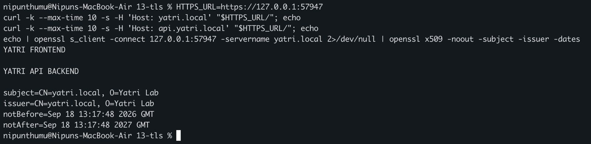

Both HTTPS routes returned the expected application text. The self-signed certificate showed subject and issuer `CN=yatri.local, O=Yatri Lab`, valid from September 18, 2026 to September 18, 2027. I used `curl -k` only because this local self-signed certificate is not trusted by a public certificate authority.

## Task 14: Automate a safe cleanup

Script: [`cleanup.sh`](14-automation/cleanup.sh)

```bash
cd ../14-automation
cat cleanup.sh
echo
bash -n cleanup.sh && echo 'Syntax check: PASS'
echo
echo 'BEFORE CLEANUP:'
kubectl get deploy,svc,ingress,configmap,secret | grep -E 'NAME|yatri'
./cleanup.sh
echo
echo 'AFTER CLEANUP:'
kubectl get deploy,svc,ingress,configmap,secret | grep yatri || echo 'No Yatri resources remain'
```

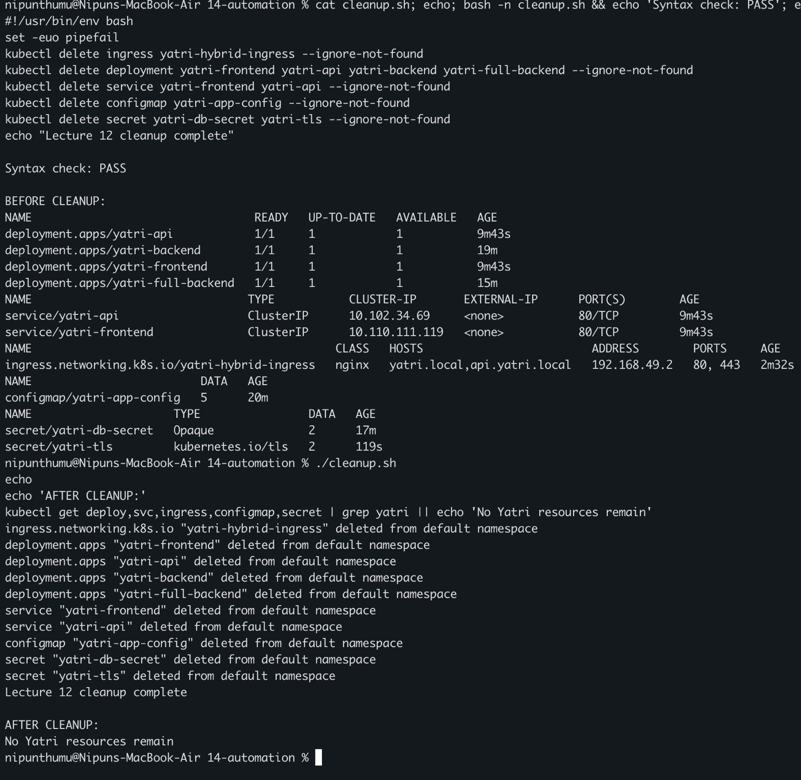

The shell syntax check passed. The script deleted only the named Yatri resources and the final check printed `No Yatri resources remain`. I then stopped the temporary proxy and tunnel with Control+C and restored the hosts file:

```bash
sudo sed -i '' '/yatri\.local/d' /etc/hosts
grep -nE 'yatri\.local|api\.yatri\.local' /etc/hosts || echo 'Hosts file restored'
```

## What I understood

- ConfigMaps are for non-confidential configuration, while Secrets are for confidential values. Secret data is base64-encoded, not encrypted by base64.
- Environment variables copied from a ConfigMap or Secret are fixed for the lifetime of a container. A rollout creates a new Pod that reads the updated values.
- A trailing newline changes the bytes of a value, so `echo -n` or `printf` matters when manually encoding exact credentials.
- Production secret handling needs a managed vault, workload identity, controlled synchronization, encryption at rest, RBAC, least privilege, rotation, and auditing.
- An Ingress resource describes routing. An Ingress controller is the running component that turns those rules into real proxy behavior.
- Path rules can split one hostname between Services, host rules can route different domains, and a hybrid Ingress can use both.
- On macOS with Minikube's Docker driver, direct node access and tunnels can behave differently from a Linux or cloud cluster. I verified the responding application instead of assuming that any HTTP 200 was success.
- TLS termination uses a `kubernetes.io/tls` Secret. Private keys and generated certificates must stay out of Git.
- Cleanup automation should name only the resources owned by the lab and use `--ignore-not-found` so it is safe to run again.

## References

- [Kubernetes ConfigMaps](https://kubernetes.io/docs/concepts/configuration/configmap/)
- [Updating configuration via a ConfigMap](https://kubernetes.io/docs/tutorials/configuration/updating-configuration-via-a-configmap/)
- [Kubernetes Secrets](https://kubernetes.io/docs/concepts/configuration/secret/)
- [Good practices for Kubernetes Secrets](https://kubernetes.io/docs/concepts/security/secrets-good-practices/)
- [Encrypting confidential data at rest](https://kubernetes.io/docs/tasks/administer-cluster/encrypt-data/)
- [Kubernetes Ingress](https://kubernetes.io/docs/concepts/services-networking/ingress/)
- [Ingress controllers](https://kubernetes.io/docs/concepts/services-networking/ingress-controllers/)
