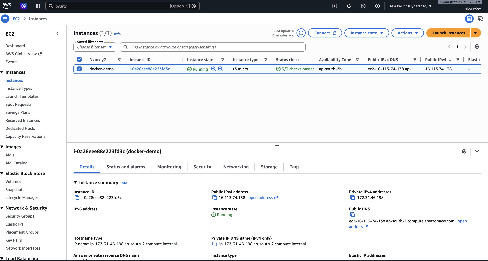

# DevOps Learning Labs

This is my DevOps homework repository. I ran the tasks on my Ubuntu EC2 instance and saved my commands, screenshots, scripts, and short notes here.

## Progress

| Module | Status |
| --- | --- |
| [Linux: soft and hard links](01-linux-fundamentals/README.md) | Complete |
| [Linux: `adduser` vs `useradd`](01-linux-fundamentals/README.md) | Complete |
| [Linux: `journalctl`](01-linux-fundamentals/README.md) | Complete |
| [Linux command cheat sheet](01-linux-fundamentals/README.md) | Complete |
| [System information shell script](02-shell-scripting/README.md) | Complete |
| [Networking fundamentals](03-networking/README.md) | Complete |
| [Git and cherry-pick](04-git/README.md) | Complete |
| [Docker applications](05-docker-apps/README.md) | Complete |
| [Docker multi-stage build](06-docker-multistage/README.md) | Complete |
| [Docker networking and volumes](07-docker-networking/README.md) | Complete |

## Environment

All were executed on Nipun's Ubuntu AWS EC2 instance. Its documentation includes AWS Console and terminal evidence connecting the instance to the submitted results.

## Safety

Secrets, private keys, `.env` files, cloud credentials, and generated runtime data must never be committed.
